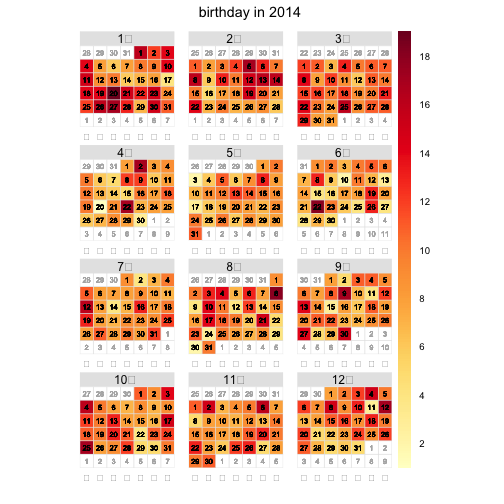

データの内容確認
===

声優さんのデータを作りました. 

```r
library(data.table)
library(dplyr)
```

```
## Warning: package 'dplyr' was built under R version 3.1.1
```

```
## 
## Attaching package: 'dplyr'
## 
##  以下のオブジェクトはマスクされています (from 'package:data.table') : 
## 
##      between, last 
## 
##  以下のオブジェクトはマスクされています (from 'package:stats') : 
## 
##      filter 
## 
##  以下のオブジェクトはマスクされています (from 'package:base') : 
## 
##      intersect, setdiff, setequal, union
```

```r
library(pipeR)
```

```
## Warning: package 'pipeR' was built under R version 3.1.1
```

## 内容確認

```r
dat = fread("va_data.txt", sep=";", header=FALSE)
dat %>% setnames(c("id", "variable", "value" ))
```
誕生日の分布調べます


```r
library(openair)
va_birthday = fread("va_birthday_data.txt", header=FALSE)
va_birthday_summarised = va_birthday %>% 
  mutate(date= as.Date(V1, format="%m-%d")) %>% 
  select(date, V2)
va_birthday_summarised %>% setnames(c("date", "birthday"))
## カレンダープロット
calendarPlot(mydata=va_birthday_summarised, pollutant = "birthday", year = 2014)
```

```
## Warning:  'mbcsToSbcs' 中の '土' で変換に失敗: <e5> をドットで置き換えました 
## Warning:  'mbcsToSbcs' 中の '土' で変換に失敗: <9c> をドットで置き換えました 
## Warning:  'mbcsToSbcs' 中の '土' で変換に失敗: <9f> をドットで置き換えました 
## Warning:  'mbcsToSbcs' 中の '日' で変換に失敗: <e6> をドットで置き換えました 
## Warning:  'mbcsToSbcs' 中の '日' で変換に失敗: <97> をドットで置き換えました 
## Warning:  'mbcsToSbcs' 中の '日' で変換に失敗: <a5> をドットで置き換えました 
## Warning:  'mbcsToSbcs' 中の '月' で変換に失敗: <e6> をドットで置き換えました 
## Warning:  'mbcsToSbcs' 中の '月' で変換に失敗: <9c> をドットで置き換えました 
## Warning:  'mbcsToSbcs' 中の '月' で変換に失敗: <88> をドットで置き換えました 
## Warning:  'mbcsToSbcs' 中の '火' で変換に失敗: <e7> をドットで置き換えました 
## Warning:  'mbcsToSbcs' 中の '火' で変換に失敗: <81> をドットで置き換えました 
## Warning:  'mbcsToSbcs' 中の '火' で変換に失敗: <ab> をドットで置き換えました 
## Warning:  'mbcsToSbcs' 中の '水' で変換に失敗: <e6> をドットで置き換えました 
## Warning:  'mbcsToSbcs' 中の '水' で変換に失敗: <b0> をドットで置き換えました 
## Warning:  'mbcsToSbcs' 中の '水' で変換に失敗: <b4> をドットで置き換えました 
## Warning:  'mbcsToSbcs' 中の '木' で変換に失敗: <e6> をドットで置き換えました 
## Warning:  'mbcsToSbcs' 中の '木' で変換に失敗: <9c> をドットで置き換えました 
## Warning:  'mbcsToSbcs' 中の '木' で変換に失敗: <a8> をドットで置き換えました 
## Warning:  'mbcsToSbcs' 中の '金' で変換に失敗: <e9> をドットで置き換えました 
## Warning:  'mbcsToSbcs' 中の '金' で変換に失敗: <87> をドットで置き換えました 
## Warning:  'mbcsToSbcs' 中の '金' で変換に失敗: <91> をドットで置き換えました 
## Warning:  'mbcsToSbcs' 中の '土' で変換に失敗: <e5> をドットで置き換えました 
## Warning:  'mbcsToSbcs' 中の '土' で変換に失敗: <9c> をドットで置き換えました 
## Warning:  'mbcsToSbcs' 中の '土' で変換に失敗: <9f> をドットで置き換えました 
## Warning:  'mbcsToSbcs' 中の '日' で変換に失敗: <e6> をドットで置き換えました 
## Warning:  'mbcsToSbcs' 中の '日' で変換に失敗: <97> をドットで置き換えました 
## Warning:  'mbcsToSbcs' 中の '日' で変換に失敗: <a5> をドットで置き換えました 
## Warning:  'mbcsToSbcs' 中の '月' で変換に失敗: <e6> をドットで置き換えました 
## Warning:  'mbcsToSbcs' 中の '月' で変換に失敗: <9c> をドットで置き換えました 
## Warning:  'mbcsToSbcs' 中の '月' で変換に失敗: <88> をドットで置き換えました 
## Warning:  'mbcsToSbcs' 中の '火' で変換に失敗: <e7> をドットで置き換えました 
## Warning:  'mbcsToSbcs' 中の '火' で変換に失敗: <81> をドットで置き換えました 
## Warning:  'mbcsToSbcs' 中の '火' で変換に失敗: <ab> をドットで置き換えました 
## Warning:  'mbcsToSbcs' 中の '水' で変換に失敗: <e6> をドットで置き換えました 
## Warning:  'mbcsToSbcs' 中の '水' で変換に失敗: <b0> をドットで置き換えました 
## Warning:  'mbcsToSbcs' 中の '水' で変換に失敗: <b4> をドットで置き換えました 
## Warning:  'mbcsToSbcs' 中の '木' で変換に失敗: <e6> をドットで置き換えました 
## Warning:  'mbcsToSbcs' 中の '木' で変換に失敗: <9c> をドットで置き換えました 
## Warning:  'mbcsToSbcs' 中の '木' で変換に失敗: <a8> をドットで置き換えました 
## Warning:  'mbcsToSbcs' 中の '金' で変換に失敗: <e9> をドットで置き換えました 
## Warning:  'mbcsToSbcs' 中の '金' で変換に失敗: <87> をドットで置き換えました 
## Warning:  'mbcsToSbcs' 中の '金' で変換に失敗: <91> をドットで置き換えました 
## Warning:  'mbcsToSbcs' 中の '土' で変換に失敗: <e5> をドットで置き換えました 
## Warning:  'mbcsToSbcs' 中の '土' で変換に失敗: <9c> をドットで置き換えました 
## Warning:  'mbcsToSbcs' 中の '土' で変換に失敗: <9f> をドットで置き換えました 
## Warning:  'mbcsToSbcs' 中の '日' で変換に失敗: <e6> をドットで置き換えました 
## Warning:  'mbcsToSbcs' 中の '日' で変換に失敗: <97> をドットで置き換えました 
## Warning:  'mbcsToSbcs' 中の '日' で変換に失敗: <a5> をドットで置き換えました 
## Warning:  'mbcsToSbcs' 中の '月' で変換に失敗: <e6> をドットで置き換えました 
## Warning:  'mbcsToSbcs' 中の '月' で変換に失敗: <9c> をドットで置き換えました 
## Warning:  'mbcsToSbcs' 中の '月' で変換に失敗: <88> をドットで置き換えました 
## Warning:  'mbcsToSbcs' 中の '火' で変換に失敗: <e7> をドットで置き換えました 
## Warning:  'mbcsToSbcs' 中の '火' で変換に失敗: <81> をドットで置き換えました 
## Warning:  'mbcsToSbcs' 中の '火' で変換に失敗: <ab> をドットで置き換えました 
## Warning:  'mbcsToSbcs' 中の '水' で変換に失敗: <e6> をドットで置き換えました 
## Warning:  'mbcsToSbcs' 中の '水' で変換に失敗: <b0> をドットで置き換えました 
## Warning:  'mbcsToSbcs' 中の '水' で変換に失敗: <b4> をドットで置き換えました 
## Warning:  'mbcsToSbcs' 中の '木' で変換に失敗: <e6> をドットで置き換えました 
## Warning:  'mbcsToSbcs' 中の '木' で変換に失敗: <9c> をドットで置き換えました 
## Warning:  'mbcsToSbcs' 中の '木' で変換に失敗: <a8> をドットで置き換えました 
## Warning:  'mbcsToSbcs' 中の '金' で変換に失敗: <e9> をドットで置き換えました 
## Warning:  'mbcsToSbcs' 中の '金' で変換に失敗: <87> をドットで置き換えました 
## Warning:  'mbcsToSbcs' 中の '金' で変換に失敗: <91> をドットで置き換えました 
## Warning:  'mbcsToSbcs' 中の '土' で変換に失敗: <e5> をドットで置き換えました 
## Warning:  'mbcsToSbcs' 中の '土' で変換に失敗: <9c> をドットで置き換えました 
## Warning:  'mbcsToSbcs' 中の '土' で変換に失敗: <9f> をドットで置き換えました 
## Warning:  'mbcsToSbcs' 中の '日' で変換に失敗: <e6> をドットで置き換えました 
## Warning:  'mbcsToSbcs' 中の '日' で変換に失敗: <97> をドットで置き換えました 
## Warning:  'mbcsToSbcs' 中の '日' で変換に失敗: <a5> をドットで置き換えました 
## Warning:  'mbcsToSbcs' 中の '月' で変換に失敗: <e6> をドットで置き換えました 
## Warning:  'mbcsToSbcs' 中の '月' で変換に失敗: <9c> をドットで置き換えました 
## Warning:  'mbcsToSbcs' 中の '月' で変換に失敗: <88> をドットで置き換えました 
## Warning:  'mbcsToSbcs' 中の '火' で変換に失敗: <e7> をドットで置き換えました 
## Warning:  'mbcsToSbcs' 中の '火' で変換に失敗: <81> をドットで置き換えました 
## Warning:  'mbcsToSbcs' 中の '火' で変換に失敗: <ab> をドットで置き換えました 
## Warning:  'mbcsToSbcs' 中の '水' で変換に失敗: <e6> をドットで置き換えました 
## Warning:  'mbcsToSbcs' 中の '水' で変換に失敗: <b0> をドットで置き換えました 
## Warning:  'mbcsToSbcs' 中の '水' で変換に失敗: <b4> をドットで置き換えました 
## Warning:  'mbcsToSbcs' 中の '木' で変換に失敗: <e6> をドットで置き換えました 
## Warning:  'mbcsToSbcs' 中の '木' で変換に失敗: <9c> をドットで置き換えました 
## Warning:  'mbcsToSbcs' 中の '木' で変換に失敗: <a8> をドットで置き換えました 
## Warning:  'mbcsToSbcs' 中の '金' で変換に失敗: <e9> をドットで置き換えました 
## Warning:  'mbcsToSbcs' 中の '金' で変換に失敗: <87> をドットで置き換えました 
## Warning:  'mbcsToSbcs' 中の '金' で変換に失敗: <91> をドットで置き換えました 
## Warning:  'mbcsToSbcs' 中の '土' で変換に失敗: <e5> をドットで置き換えました 
## Warning:  'mbcsToSbcs' 中の '土' で変換に失敗: <9c> をドットで置き換えました 
## Warning:  'mbcsToSbcs' 中の '土' で変換に失敗: <9f> をドットで置き換えました 
## Warning:  'mbcsToSbcs' 中の '日' で変換に失敗: <e6> をドットで置き換えました 
## Warning:  'mbcsToSbcs' 中の '日' で変換に失敗: <97> をドットで置き換えました 
## Warning:  'mbcsToSbcs' 中の '日' で変換に失敗: <a5> をドットで置き換えました 
## Warning:  'mbcsToSbcs' 中の '月' で変換に失敗: <e6> をドットで置き換えました 
## Warning:  'mbcsToSbcs' 中の '月' で変換に失敗: <9c> をドットで置き換えました 
## Warning:  'mbcsToSbcs' 中の '月' で変換に失敗: <88> をドットで置き換えました 
## Warning:  'mbcsToSbcs' 中の '火' で変換に失敗: <e7> をドットで置き換えました 
## Warning:  'mbcsToSbcs' 中の '火' で変換に失敗: <81> をドットで置き換えました 
## Warning:  'mbcsToSbcs' 中の '火' で変換に失敗: <ab> をドットで置き換えました 
## Warning:  'mbcsToSbcs' 中の '水' で変換に失敗: <e6> をドットで置き換えました 
## Warning:  'mbcsToSbcs' 中の '水' で変換に失敗: <b0> をドットで置き換えました 
## Warning:  'mbcsToSbcs' 中の '水' で変換に失敗: <b4> をドットで置き換えました 
## Warning:  'mbcsToSbcs' 中の '木' で変換に失敗: <e6> をドットで置き換えました 
## Warning:  'mbcsToSbcs' 中の '木' で変換に失敗: <9c> をドットで置き換えました 
## Warning:  'mbcsToSbcs' 中の '木' で変換に失敗: <a8> をドットで置き換えました 
## Warning:  'mbcsToSbcs' 中の '金' で変換に失敗: <e9> をドットで置き換えました 
## Warning:  'mbcsToSbcs' 中の '金' で変換に失敗: <87> をドットで置き換えました 
## Warning:  'mbcsToSbcs' 中の '金' で変換に失敗: <91> をドットで置き換えました 
## Warning:  'mbcsToSbcs' 中の '土' で変換に失敗: <e5> をドットで置き換えました 
## Warning:  'mbcsToSbcs' 中の '土' で変換に失敗: <9c> をドットで置き換えました 
## Warning:  'mbcsToSbcs' 中の '土' で変換に失敗: <9f> をドットで置き換えました 
## Warning:  'mbcsToSbcs' 中の '日' で変換に失敗: <e6> をドットで置き換えました 
## Warning:  'mbcsToSbcs' 中の '日' で変換に失敗: <97> をドットで置き換えました 
## Warning:  'mbcsToSbcs' 中の '日' で変換に失敗: <a5> をドットで置き換えました 
## Warning:  'mbcsToSbcs' 中の '月' で変換に失敗: <e6> をドットで置き換えました 
## Warning:  'mbcsToSbcs' 中の '月' で変換に失敗: <9c> をドットで置き換えました 
## Warning:  'mbcsToSbcs' 中の '月' で変換に失敗: <88> をドットで置き換えました 
## Warning:  'mbcsToSbcs' 中の '火' で変換に失敗: <e7> をドットで置き換えました 
## Warning:  'mbcsToSbcs' 中の '火' で変換に失敗: <81> をドットで置き換えました 
## Warning:  'mbcsToSbcs' 中の '火' で変換に失敗: <ab> をドットで置き換えました 
## Warning:  'mbcsToSbcs' 中の '水' で変換に失敗: <e6> をドットで置き換えました 
## Warning:  'mbcsToSbcs' 中の '水' で変換に失敗: <b0> をドットで置き換えました 
## Warning:  'mbcsToSbcs' 中の '水' で変換に失敗: <b4> をドットで置き換えました 
## Warning:  'mbcsToSbcs' 中の '木' で変換に失敗: <e6> をドットで置き換えました 
## Warning:  'mbcsToSbcs' 中の '木' で変換に失敗: <9c> をドットで置き換えました 
## Warning:  'mbcsToSbcs' 中の '木' で変換に失敗: <a8> をドットで置き換えました 
## Warning:  'mbcsToSbcs' 中の '金' で変換に失敗: <e9> をドットで置き換えました 
## Warning:  'mbcsToSbcs' 中の '金' で変換に失敗: <87> をドットで置き換えました 
## Warning:  'mbcsToSbcs' 中の '金' で変換に失敗: <91> をドットで置き換えました 
## Warning:  'mbcsToSbcs' 中の '土' で変換に失敗: <e5> をドットで置き換えました 
## Warning:  'mbcsToSbcs' 中の '土' で変換に失敗: <9c> をドットで置き換えました 
## Warning:  'mbcsToSbcs' 中の '土' で変換に失敗: <9f> をドットで置き換えました 
## Warning:  'mbcsToSbcs' 中の '日' で変換に失敗: <e6> をドットで置き換えました 
## Warning:  'mbcsToSbcs' 中の '日' で変換に失敗: <97> をドットで置き換えました 
## Warning:  'mbcsToSbcs' 中の '日' で変換に失敗: <a5> をドットで置き換えました 
## Warning:  'mbcsToSbcs' 中の '月' で変換に失敗: <e6> をドットで置き換えました 
## Warning:  'mbcsToSbcs' 中の '月' で変換に失敗: <9c> をドットで置き換えました 
## Warning:  'mbcsToSbcs' 中の '月' で変換に失敗: <88> をドットで置き換えました 
## Warning:  'mbcsToSbcs' 中の '火' で変換に失敗: <e7> をドットで置き換えました 
## Warning:  'mbcsToSbcs' 中の '火' で変換に失敗: <81> をドットで置き換えました 
## Warning:  'mbcsToSbcs' 中の '火' で変換に失敗: <ab> をドットで置き換えました 
## Warning:  'mbcsToSbcs' 中の '水' で変換に失敗: <e6> をドットで置き換えました 
## Warning:  'mbcsToSbcs' 中の '水' で変換に失敗: <b0> をドットで置き換えました 
## Warning:  'mbcsToSbcs' 中の '水' で変換に失敗: <b4> をドットで置き換えました 
## Warning:  'mbcsToSbcs' 中の '木' で変換に失敗: <e6> をドットで置き換えました 
## Warning:  'mbcsToSbcs' 中の '木' で変換に失敗: <9c> をドットで置き換えました 
## Warning:  'mbcsToSbcs' 中の '木' で変換に失敗: <a8> をドットで置き換えました 
## Warning:  'mbcsToSbcs' 中の '金' で変換に失敗: <e9> をドットで置き換えました 
## Warning:  'mbcsToSbcs' 中の '金' で変換に失敗: <87> をドットで置き換えました 
## Warning:  'mbcsToSbcs' 中の '金' で変換に失敗: <91> をドットで置き換えました 
## Warning:  'mbcsToSbcs' 中の '土' で変換に失敗: <e5> をドットで置き換えました 
## Warning:  'mbcsToSbcs' 中の '土' で変換に失敗: <9c> をドットで置き換えました 
## Warning:  'mbcsToSbcs' 中の '土' で変換に失敗: <9f> をドットで置き換えました 
## Warning:  'mbcsToSbcs' 中の '日' で変換に失敗: <e6> をドットで置き換えました 
## Warning:  'mbcsToSbcs' 中の '日' で変換に失敗: <97> をドットで置き換えました 
## Warning:  'mbcsToSbcs' 中の '日' で変換に失敗: <a5> をドットで置き換えました 
## Warning:  'mbcsToSbcs' 中の '月' で変換に失敗: <e6> をドットで置き換えました 
## Warning:  'mbcsToSbcs' 中の '月' で変換に失敗: <9c> をドットで置き換えました 
## Warning:  'mbcsToSbcs' 中の '月' で変換に失敗: <88> をドットで置き換えました 
## Warning:  'mbcsToSbcs' 中の '火' で変換に失敗: <e7> をドットで置き換えました 
## Warning:  'mbcsToSbcs' 中の '火' で変換に失敗: <81> をドットで置き換えました 
## Warning:  'mbcsToSbcs' 中の '火' で変換に失敗: <ab> をドットで置き換えました 
## Warning:  'mbcsToSbcs' 中の '水' で変換に失敗: <e6> をドットで置き換えました 
## Warning:  'mbcsToSbcs' 中の '水' で変換に失敗: <b0> をドットで置き換えました 
## Warning:  'mbcsToSbcs' 中の '水' で変換に失敗: <b4> をドットで置き換えました 
## Warning:  'mbcsToSbcs' 中の '木' で変換に失敗: <e6> をドットで置き換えました 
## Warning:  'mbcsToSbcs' 中の '木' で変換に失敗: <9c> をドットで置き換えました 
## Warning:  'mbcsToSbcs' 中の '木' で変換に失敗: <a8> をドットで置き換えました 
## Warning:  'mbcsToSbcs' 中の '金' で変換に失敗: <e9> をドットで置き換えました 
## Warning:  'mbcsToSbcs' 中の '金' で変換に失敗: <87> をドットで置き換えました 
## Warning:  'mbcsToSbcs' 中の '金' で変換に失敗: <91> をドットで置き換えました 
## Warning:  'mbcsToSbcs' 中の '土' で変換に失敗: <e5> をドットで置き換えました 
## Warning:  'mbcsToSbcs' 中の '土' で変換に失敗: <9c> をドットで置き換えました 
## Warning:  'mbcsToSbcs' 中の '土' で変換に失敗: <9f> をドットで置き換えました 
## Warning:  'mbcsToSbcs' 中の '日' で変換に失敗: <e6> をドットで置き換えました 
## Warning:  'mbcsToSbcs' 中の '日' で変換に失敗: <97> をドットで置き換えました 
## Warning:  'mbcsToSbcs' 中の '日' で変換に失敗: <a5> をドットで置き換えました 
## Warning:  'mbcsToSbcs' 中の '月' で変換に失敗: <e6> をドットで置き換えました 
## Warning:  'mbcsToSbcs' 中の '月' で変換に失敗: <9c> をドットで置き換えました 
## Warning:  'mbcsToSbcs' 中の '月' で変換に失敗: <88> をドットで置き換えました 
## Warning:  'mbcsToSbcs' 中の '火' で変換に失敗: <e7> をドットで置き換えました 
## Warning:  'mbcsToSbcs' 中の '火' で変換に失敗: <81> をドットで置き換えました 
## Warning:  'mbcsToSbcs' 中の '火' で変換に失敗: <ab> をドットで置き換えました 
## Warning:  'mbcsToSbcs' 中の '水' で変換に失敗: <e6> をドットで置き換えました 
## Warning:  'mbcsToSbcs' 中の '水' で変換に失敗: <b0> をドットで置き換えました 
## Warning:  'mbcsToSbcs' 中の '水' で変換に失敗: <b4> をドットで置き換えました 
## Warning:  'mbcsToSbcs' 中の '木' で変換に失敗: <e6> をドットで置き換えました 
## Warning:  'mbcsToSbcs' 中の '木' で変換に失敗: <9c> をドットで置き換えました 
## Warning:  'mbcsToSbcs' 中の '木' で変換に失敗: <a8> をドットで置き換えました 
## Warning:  'mbcsToSbcs' 中の '金' で変換に失敗: <e9> をドットで置き換えました 
## Warning:  'mbcsToSbcs' 中の '金' で変換に失敗: <87> をドットで置き換えました 
## Warning:  'mbcsToSbcs' 中の '金' で変換に失敗: <91> をドットで置き換えました 
## Warning:  'mbcsToSbcs' 中の '土' で変換に失敗: <e5> をドットで置き換えました 
## Warning:  'mbcsToSbcs' 中の '土' で変換に失敗: <9c> をドットで置き換えました 
## Warning:  'mbcsToSbcs' 中の '土' で変換に失敗: <9f> をドットで置き換えました 
## Warning:  'mbcsToSbcs' 中の '日' で変換に失敗: <e6> をドットで置き換えました 
## Warning:  'mbcsToSbcs' 中の '日' で変換に失敗: <97> をドットで置き換えました 
## Warning:  'mbcsToSbcs' 中の '日' で変換に失敗: <a5> をドットで置き換えました 
## Warning:  'mbcsToSbcs' 中の '月' で変換に失敗: <e6> をドットで置き換えました 
## Warning:  'mbcsToSbcs' 中の '月' で変換に失敗: <9c> をドットで置き換えました 
## Warning:  'mbcsToSbcs' 中の '月' で変換に失敗: <88> をドットで置き換えました 
## Warning:  'mbcsToSbcs' 中の '火' で変換に失敗: <e7> をドットで置き換えました 
## Warning:  'mbcsToSbcs' 中の '火' で変換に失敗: <81> をドットで置き換えました 
## Warning:  'mbcsToSbcs' 中の '火' で変換に失敗: <ab> をドットで置き換えました 
## Warning:  'mbcsToSbcs' 中の '水' で変換に失敗: <e6> をドットで置き換えました 
## Warning:  'mbcsToSbcs' 中の '水' で変換に失敗: <b0> をドットで置き換えました 
## Warning:  'mbcsToSbcs' 中の '水' で変換に失敗: <b4> をドットで置き換えました 
## Warning:  'mbcsToSbcs' 中の '木' で変換に失敗: <e6> をドットで置き換えました 
## Warning:  'mbcsToSbcs' 中の '木' で変換に失敗: <9c> をドットで置き換えました 
## Warning:  'mbcsToSbcs' 中の '木' で変換に失敗: <a8> をドットで置き換えました 
## Warning:  'mbcsToSbcs' 中の '金' で変換に失敗: <e9> をドットで置き換えました 
## Warning:  'mbcsToSbcs' 中の '金' で変換に失敗: <87> をドットで置き換えました 
## Warning:  'mbcsToSbcs' 中の '金' で変換に失敗: <91> をドットで置き換えました 
## Warning:  'mbcsToSbcs' 中の '土' で変換に失敗: <e5> をドットで置き換えました 
## Warning:  'mbcsToSbcs' 中の '土' で変換に失敗: <9c> をドットで置き換えました 
## Warning:  'mbcsToSbcs' 中の '土' で変換に失敗: <9f> をドットで置き換えました 
## Warning:  'mbcsToSbcs' 中の '日' で変換に失敗: <e6> をドットで置き換えました 
## Warning:  'mbcsToSbcs' 中の '日' で変換に失敗: <97> をドットで置き換えました 
## Warning:  'mbcsToSbcs' 中の '日' で変換に失敗: <a5> をドットで置き換えました 
## Warning:  'mbcsToSbcs' 中の '月' で変換に失敗: <e6> をドットで置き換えました 
## Warning:  'mbcsToSbcs' 中の '月' で変換に失敗: <9c> をドットで置き換えました 
## Warning:  'mbcsToSbcs' 中の '月' で変換に失敗: <88> をドットで置き換えました 
## Warning:  'mbcsToSbcs' 中の '火' で変換に失敗: <e7> をドットで置き換えました 
## Warning:  'mbcsToSbcs' 中の '火' で変換に失敗: <81> をドットで置き換えました 
## Warning:  'mbcsToSbcs' 中の '火' で変換に失敗: <ab> をドットで置き換えました 
## Warning:  'mbcsToSbcs' 中の '水' で変換に失敗: <e6> をドットで置き換えました 
## Warning:  'mbcsToSbcs' 中の '水' で変換に失敗: <b0> をドットで置き換えました 
## Warning:  'mbcsToSbcs' 中の '水' で変換に失敗: <b4> をドットで置き換えました 
## Warning:  'mbcsToSbcs' 中の '木' で変換に失敗: <e6> をドットで置き換えました 
## Warning:  'mbcsToSbcs' 中の '木' で変換に失敗: <9c> をドットで置き換えました 
## Warning:  'mbcsToSbcs' 中の '木' で変換に失敗: <a8> をドットで置き換えました 
## Warning:  'mbcsToSbcs' 中の '金' で変換に失敗: <e9> をドットで置き換えました 
## Warning:  'mbcsToSbcs' 中の '金' で変換に失敗: <87> をドットで置き換えました 
## Warning:  'mbcsToSbcs' 中の '金' で変換に失敗: <91> をドットで置き換えました 
## Warning:  'mbcsToSbcs' 中の '土' で変換に失敗: <e5> をドットで置き換えました 
## Warning:  'mbcsToSbcs' 中の '土' で変換に失敗: <9c> をドットで置き換えました 
## Warning:  'mbcsToSbcs' 中の '土' で変換に失敗: <9f> をドットで置き換えました 
## Warning:  'mbcsToSbcs' 中の '日' で変換に失敗: <e6> をドットで置き換えました 
## Warning:  'mbcsToSbcs' 中の '日' で変換に失敗: <97> をドットで置き換えました 
## Warning:  'mbcsToSbcs' 中の '日' で変換に失敗: <a5> をドットで置き換えました 
## Warning:  'mbcsToSbcs' 中の '月' で変換に失敗: <e6> をドットで置き換えました 
## Warning:  'mbcsToSbcs' 中の '月' で変換に失敗: <9c> をドットで置き換えました 
## Warning:  'mbcsToSbcs' 中の '月' で変換に失敗: <88> をドットで置き換えました 
## Warning:  'mbcsToSbcs' 中の '火' で変換に失敗: <e7> をドットで置き換えました 
## Warning:  'mbcsToSbcs' 中の '火' で変換に失敗: <81> をドットで置き換えました 
## Warning:  'mbcsToSbcs' 中の '火' で変換に失敗: <ab> をドットで置き換えました 
## Warning:  'mbcsToSbcs' 中の '水' で変換に失敗: <e6> をドットで置き換えました 
## Warning:  'mbcsToSbcs' 中の '水' で変換に失敗: <b0> をドットで置き換えました 
## Warning:  'mbcsToSbcs' 中の '水' で変換に失敗: <b4> をドットで置き換えました 
## Warning:  'mbcsToSbcs' 中の '木' で変換に失敗: <e6> をドットで置き換えました 
## Warning:  'mbcsToSbcs' 中の '木' で変換に失敗: <9c> をドットで置き換えました 
## Warning:  'mbcsToSbcs' 中の '木' で変換に失敗: <a8> をドットで置き換えました 
## Warning:  'mbcsToSbcs' 中の '金' で変換に失敗: <e9> をドットで置き換えました 
## Warning:  'mbcsToSbcs' 中の '金' で変換に失敗: <87> をドットで置き換えました 
## Warning:  'mbcsToSbcs' 中の '金' で変換に失敗: <91> をドットで置き換えました 
## Warning:  'mbcsToSbcs' 中の '土' で変換に失敗: <e5> をドットで置き換えました 
## Warning:  'mbcsToSbcs' 中の '土' で変換に失敗: <9c> をドットで置き換えました 
## Warning:  'mbcsToSbcs' 中の '土' で変換に失敗: <9f> をドットで置き換えました 
## Warning:  'mbcsToSbcs' 中の '日' で変換に失敗: <e6> をドットで置き換えました 
## Warning:  'mbcsToSbcs' 中の '日' で変換に失敗: <97> をドットで置き換えました 
## Warning:  'mbcsToSbcs' 中の '日' で変換に失敗: <a5> をドットで置き換えました 
## Warning:  'mbcsToSbcs' 中の '月' で変換に失敗: <e6> をドットで置き換えました 
## Warning:  'mbcsToSbcs' 中の '月' で変換に失敗: <9c> をドットで置き換えました 
## Warning:  'mbcsToSbcs' 中の '月' で変換に失敗: <88> をドットで置き換えました 
## Warning:  'mbcsToSbcs' 中の '火' で変換に失敗: <e7> をドットで置き換えました 
## Warning:  'mbcsToSbcs' 中の '火' で変換に失敗: <81> をドットで置き換えました 
## Warning:  'mbcsToSbcs' 中の '火' で変換に失敗: <ab> をドットで置き換えました 
## Warning:  'mbcsToSbcs' 中の '水' で変換に失敗: <e6> をドットで置き換えました 
## Warning:  'mbcsToSbcs' 中の '水' で変換に失敗: <b0> をドットで置き換えました 
## Warning:  'mbcsToSbcs' 中の '水' で変換に失敗: <b4> をドットで置き換えました 
## Warning:  'mbcsToSbcs' 中の '木' で変換に失敗: <e6> をドットで置き換えました 
## Warning:  'mbcsToSbcs' 中の '木' で変換に失敗: <9c> をドットで置き換えました 
## Warning:  'mbcsToSbcs' 中の '木' で変換に失敗: <a8> をドットで置き換えました 
## Warning:  'mbcsToSbcs' 中の '金' で変換に失敗: <e9> をドットで置き換えました 
## Warning:  'mbcsToSbcs' 中の '金' で変換に失敗: <87> をドットで置き換えました 
## Warning:  'mbcsToSbcs' 中の '金' で変換に失敗: <91> をドットで置き換えました 
## Warning:  'mbcsToSbcs' 中の '土' で変換に失敗: <e5> をドットで置き換えました 
## Warning:  'mbcsToSbcs' 中の '土' で変換に失敗: <9c> をドットで置き換えました 
## Warning:  'mbcsToSbcs' 中の '土' で変換に失敗: <9f> をドットで置き換えました 
## Warning:  'mbcsToSbcs' 中の '日' で変換に失敗: <e6> をドットで置き換えました 
## Warning:  'mbcsToSbcs' 中の '日' で変換に失敗: <97> をドットで置き換えました 
## Warning:  'mbcsToSbcs' 中の '日' で変換に失敗: <a5> をドットで置き換えました 
## Warning:  'mbcsToSbcs' 中の '月' で変換に失敗: <e6> をドットで置き換えました 
## Warning:  'mbcsToSbcs' 中の '月' で変換に失敗: <9c> をドットで置き換えました 
## Warning:  'mbcsToSbcs' 中の '月' で変換に失敗: <88> をドットで置き換えました 
## Warning:  'mbcsToSbcs' 中の '火' で変換に失敗: <e7> をドットで置き換えました 
## Warning:  'mbcsToSbcs' 中の '火' で変換に失敗: <81> をドットで置き換えました 
## Warning:  'mbcsToSbcs' 中の '火' で変換に失敗: <ab> をドットで置き換えました 
## Warning:  'mbcsToSbcs' 中の '水' で変換に失敗: <e6> をドットで置き換えました 
## Warning:  'mbcsToSbcs' 中の '水' で変換に失敗: <b0> をドットで置き換えました 
## Warning:  'mbcsToSbcs' 中の '水' で変換に失敗: <b4> をドットで置き換えました 
## Warning:  'mbcsToSbcs' 中の '木' で変換に失敗: <e6> をドットで置き換えました 
## Warning:  'mbcsToSbcs' 中の '木' で変換に失敗: <9c> をドットで置き換えました 
## Warning:  'mbcsToSbcs' 中の '木' で変換に失敗: <a8> をドットで置き換えました 
## Warning:  'mbcsToSbcs' 中の '金' で変換に失敗: <e9> をドットで置き換えました 
## Warning:  'mbcsToSbcs' 中の '金' で変換に失敗: <87> をドットで置き換えました 
## Warning:  'mbcsToSbcs' 中の '金' で変換に失敗: <91> をドットで置き換えました 
## Warning:  'mbcsToSbcs' 中の '土' で変換に失敗: <e5> をドットで置き換えました 
## Warning:  'mbcsToSbcs' 中の '土' で変換に失敗: <9c> をドットで置き換えました 
## Warning:  'mbcsToSbcs' 中の '土' で変換に失敗: <9f> をドットで置き換えました 
## Warning:  'mbcsToSbcs' 中の '日' で変換に失敗: <e6> をドットで置き換えました 
## Warning:  'mbcsToSbcs' 中の '日' で変換に失敗: <97> をドットで置き換えました 
## Warning:  'mbcsToSbcs' 中の '日' で変換に失敗: <a5> をドットで置き換えました 
## Warning:  'mbcsToSbcs' 中の '月' で変換に失敗: <e6> をドットで置き換えました 
## Warning:  'mbcsToSbcs' 中の '月' で変換に失敗: <9c> をドットで置き換えました 
## Warning:  'mbcsToSbcs' 中の '月' で変換に失敗: <88> をドットで置き換えました 
## Warning:  'mbcsToSbcs' 中の '火' で変換に失敗: <e7> をドットで置き換えました 
## Warning:  'mbcsToSbcs' 中の '火' で変換に失敗: <81> をドットで置き換えました 
## Warning:  'mbcsToSbcs' 中の '火' で変換に失敗: <ab> をドットで置き換えました 
## Warning:  'mbcsToSbcs' 中の '水' で変換に失敗: <e6> をドットで置き換えました 
## Warning:  'mbcsToSbcs' 中の '水' で変換に失敗: <b0> をドットで置き換えました 
## Warning:  'mbcsToSbcs' 中の '水' で変換に失敗: <b4> をドットで置き換えました 
## Warning:  'mbcsToSbcs' 中の '木' で変換に失敗: <e6> をドットで置き換えました 
## Warning:  'mbcsToSbcs' 中の '木' で変換に失敗: <9c> をドットで置き換えました 
## Warning:  'mbcsToSbcs' 中の '木' で変換に失敗: <a8> をドットで置き換えました 
## Warning:  'mbcsToSbcs' 中の '金' で変換に失敗: <e9> をドットで置き換えました 
## Warning:  'mbcsToSbcs' 中の '金' で変換に失敗: <87> をドットで置き換えました 
## Warning:  'mbcsToSbcs' 中の '金' で変換に失敗: <91> をドットで置き換えました 
## Warning:  'mbcsToSbcs' 中の '土' で変換に失敗: <e5> をドットで置き換えました 
## Warning:  'mbcsToSbcs' 中の '土' で変換に失敗: <9c> をドットで置き換えました 
## Warning:  'mbcsToSbcs' 中の '土' で変換に失敗: <9f> をドットで置き換えました 
## Warning:  'mbcsToSbcs' 中の '日' で変換に失敗: <e6> をドットで置き換えました 
## Warning:  'mbcsToSbcs' 中の '日' で変換に失敗: <97> をドットで置き換えました 
## Warning:  'mbcsToSbcs' 中の '日' で変換に失敗: <a5> をドットで置き換えました 
## Warning:  'mbcsToSbcs' 中の '月' で変換に失敗: <e6> をドットで置き換えました 
## Warning:  'mbcsToSbcs' 中の '月' で変換に失敗: <9c> をドットで置き換えました 
## Warning:  'mbcsToSbcs' 中の '月' で変換に失敗: <88> をドットで置き換えました 
## Warning:  'mbcsToSbcs' 中の '火' で変換に失敗: <e7> をドットで置き換えました 
## Warning:  'mbcsToSbcs' 中の '火' で変換に失敗: <81> をドットで置き換えました 
## Warning:  'mbcsToSbcs' 中の '火' で変換に失敗: <ab> をドットで置き換えました 
## Warning:  'mbcsToSbcs' 中の '水' で変換に失敗: <e6> をドットで置き換えました 
## Warning:  'mbcsToSbcs' 中の '水' で変換に失敗: <b0> をドットで置き換えました 
## Warning:  'mbcsToSbcs' 中の '水' で変換に失敗: <b4> をドットで置き換えました 
## Warning:  'mbcsToSbcs' 中の '木' で変換に失敗: <e6> をドットで置き換えました 
## Warning:  'mbcsToSbcs' 中の '木' で変換に失敗: <9c> をドットで置き換えました 
## Warning:  'mbcsToSbcs' 中の '木' で変換に失敗: <a8> をドットで置き換えました 
## Warning:  'mbcsToSbcs' 中の '金' で変換に失敗: <e9> をドットで置き換えました 
## Warning:  'mbcsToSbcs' 中の '金' で変換に失敗: <87> をドットで置き換えました 
## Warning:  'mbcsToSbcs' 中の '金' で変換に失敗: <91> をドットで置き換えました 
## Warning:  'mbcsToSbcs' 中の '土' で変換に失敗: <e5> をドットで置き換えました 
## Warning:  'mbcsToSbcs' 中の '土' で変換に失敗: <9c> をドットで置き換えました 
## Warning:  'mbcsToSbcs' 中の '土' で変換に失敗: <9f> をドットで置き換えました 
## Warning:  'mbcsToSbcs' 中の '日' で変換に失敗: <e6> をドットで置き換えました 
## Warning:  'mbcsToSbcs' 中の '日' で変換に失敗: <97> をドットで置き換えました 
## Warning:  'mbcsToSbcs' 中の '日' で変換に失敗: <a5> をドットで置き換えました 
## Warning:  'mbcsToSbcs' 中の '月' で変換に失敗: <e6> をドットで置き換えました 
## Warning:  'mbcsToSbcs' 中の '月' で変換に失敗: <9c> をドットで置き換えました 
## Warning:  'mbcsToSbcs' 中の '月' で変換に失敗: <88> をドットで置き換えました 
## Warning:  'mbcsToSbcs' 中の '火' で変換に失敗: <e7> をドットで置き換えました 
## Warning:  'mbcsToSbcs' 中の '火' で変換に失敗: <81> をドットで置き換えました 
## Warning:  'mbcsToSbcs' 中の '火' で変換に失敗: <ab> をドットで置き換えました 
## Warning:  'mbcsToSbcs' 中の '水' で変換に失敗: <e6> をドットで置き換えました 
## Warning:  'mbcsToSbcs' 中の '水' で変換に失敗: <b0> をドットで置き換えました 
## Warning:  'mbcsToSbcs' 中の '水' で変換に失敗: <b4> をドットで置き換えました 
## Warning:  'mbcsToSbcs' 中の '木' で変換に失敗: <e6> をドットで置き換えました 
## Warning:  'mbcsToSbcs' 中の '木' で変換に失敗: <9c> をドットで置き換えました 
## Warning:  'mbcsToSbcs' 中の '木' で変換に失敗: <a8> をドットで置き換えました 
## Warning:  'mbcsToSbcs' 中の '金' で変換に失敗: <e9> をドットで置き換えました 
## Warning:  'mbcsToSbcs' 中の '金' で変換に失敗: <87> をドットで置き換えました 
## Warning:  'mbcsToSbcs' 中の '金' で変換に失敗: <91> をドットで置き換えました 
## Warning:  'mbcsToSbcs' 中の '土' で変換に失敗: <e5> をドットで置き換えました 
## Warning:  'mbcsToSbcs' 中の '土' で変換に失敗: <9c> をドットで置き換えました 
## Warning:  'mbcsToSbcs' 中の '土' で変換に失敗: <9f> をドットで置き換えました 
## Warning:  'mbcsToSbcs' 中の '日' で変換に失敗: <e6> をドットで置き換えました 
## Warning:  'mbcsToSbcs' 中の '日' で変換に失敗: <97> をドットで置き換えました 
## Warning:  'mbcsToSbcs' 中の '日' で変換に失敗: <a5> をドットで置き換えました 
## Warning:  'mbcsToSbcs' 中の '月' で変換に失敗: <e6> をドットで置き換えました 
## Warning:  'mbcsToSbcs' 中の '月' で変換に失敗: <9c> をドットで置き換えました 
## Warning:  'mbcsToSbcs' 中の '月' で変換に失敗: <88> をドットで置き換えました 
## Warning:  'mbcsToSbcs' 中の '火' で変換に失敗: <e7> をドットで置き換えました 
## Warning:  'mbcsToSbcs' 中の '火' で変換に失敗: <81> をドットで置き換えました 
## Warning:  'mbcsToSbcs' 中の '火' で変換に失敗: <ab> をドットで置き換えました 
## Warning:  'mbcsToSbcs' 中の '水' で変換に失敗: <e6> をドットで置き換えました 
## Warning:  'mbcsToSbcs' 中の '水' で変換に失敗: <b0> をドットで置き換えました 
## Warning:  'mbcsToSbcs' 中の '水' で変換に失敗: <b4> をドットで置き換えました 
## Warning:  'mbcsToSbcs' 中の '木' で変換に失敗: <e6> をドットで置き換えました 
## Warning:  'mbcsToSbcs' 中の '木' で変換に失敗: <9c> をドットで置き換えました 
## Warning:  'mbcsToSbcs' 中の '木' で変換に失敗: <a8> をドットで置き換えました 
## Warning:  'mbcsToSbcs' 中の '金' で変換に失敗: <e9> をドットで置き換えました 
## Warning:  'mbcsToSbcs' 中の '金' で変換に失敗: <87> をドットで置き換えました 
## Warning:  'mbcsToSbcs' 中の '金' で変換に失敗: <91> をドットで置き換えました 
## Warning:  'mbcsToSbcs' 中の '土' で変換に失敗: <e5> をドットで置き換えました 
## Warning:  'mbcsToSbcs' 中の '土' で変換に失敗: <9c> をドットで置き換えました 
## Warning:  'mbcsToSbcs' 中の '土' で変換に失敗: <9f> をドットで置き換えました 
## Warning:  'mbcsToSbcs' 中の '日' で変換に失敗: <e6> をドットで置き換えました 
## Warning:  'mbcsToSbcs' 中の '日' で変換に失敗: <97> をドットで置き換えました 
## Warning:  'mbcsToSbcs' 中の '日' で変換に失敗: <a5> をドットで置き換えました 
## Warning:  'mbcsToSbcs' 中の '月' で変換に失敗: <e6> をドットで置き換えました 
## Warning:  'mbcsToSbcs' 中の '月' で変換に失敗: <9c> をドットで置き換えました 
## Warning:  'mbcsToSbcs' 中の '月' で変換に失敗: <88> をドットで置き換えました 
## Warning:  'mbcsToSbcs' 中の '火' で変換に失敗: <e7> をドットで置き換えました 
## Warning:  'mbcsToSbcs' 中の '火' で変換に失敗: <81> をドットで置き換えました 
## Warning:  'mbcsToSbcs' 中の '火' で変換に失敗: <ab> をドットで置き換えました 
## Warning:  'mbcsToSbcs' 中の '水' で変換に失敗: <e6> をドットで置き換えました 
## Warning:  'mbcsToSbcs' 中の '水' で変換に失敗: <b0> をドットで置き換えました 
## Warning:  'mbcsToSbcs' 中の '水' で変換に失敗: <b4> をドットで置き換えました 
## Warning:  'mbcsToSbcs' 中の '木' で変換に失敗: <e6> をドットで置き換えました 
## Warning:  'mbcsToSbcs' 中の '木' で変換に失敗: <9c> をドットで置き換えました 
## Warning:  'mbcsToSbcs' 中の '木' で変換に失敗: <a8> をドットで置き換えました 
## Warning:  'mbcsToSbcs' 中の '金' で変換に失敗: <e9> をドットで置き換えました 
## Warning:  'mbcsToSbcs' 中の '金' で変換に失敗: <87> をドットで置き換えました 
## Warning:  'mbcsToSbcs' 中の '金' で変換に失敗: <91> をドットで置き換えました 
## Warning:  'mbcsToSbcs' 中の '土' で変換に失敗: <e5> をドットで置き換えました 
## Warning:  'mbcsToSbcs' 中の '土' で変換に失敗: <9c> をドットで置き換えました 
## Warning:  'mbcsToSbcs' 中の '土' で変換に失敗: <9f> をドットで置き換えました 
## Warning:  'mbcsToSbcs' 中の '日' で変換に失敗: <e6> をドットで置き換えました 
## Warning:  'mbcsToSbcs' 中の '日' で変換に失敗: <97> をドットで置き換えました 
## Warning:  'mbcsToSbcs' 中の '日' で変換に失敗: <a5> をドットで置き換えました 
## Warning:  'mbcsToSbcs' 中の '月' で変換に失敗: <e6> をドットで置き換えました 
## Warning:  'mbcsToSbcs' 中の '月' で変換に失敗: <9c> をドットで置き換えました 
## Warning:  'mbcsToSbcs' 中の '月' で変換に失敗: <88> をドットで置き換えました 
## Warning:  'mbcsToSbcs' 中の '火' で変換に失敗: <e7> をドットで置き換えました 
## Warning:  'mbcsToSbcs' 中の '火' で変換に失敗: <81> をドットで置き換えました 
## Warning:  'mbcsToSbcs' 中の '火' で変換に失敗: <ab> をドットで置き換えました 
## Warning:  'mbcsToSbcs' 中の '水' で変換に失敗: <e6> をドットで置き換えました 
## Warning:  'mbcsToSbcs' 中の '水' で変換に失敗: <b0> をドットで置き換えました 
## Warning:  'mbcsToSbcs' 中の '水' で変換に失敗: <b4> をドットで置き換えました 
## Warning:  'mbcsToSbcs' 中の '木' で変換に失敗: <e6> をドットで置き換えました 
## Warning:  'mbcsToSbcs' 中の '木' で変換に失敗: <9c> をドットで置き換えました 
## Warning:  'mbcsToSbcs' 中の '木' で変換に失敗: <a8> をドットで置き換えました 
## Warning:  'mbcsToSbcs' 中の '金' で変換に失敗: <e9> をドットで置き換えました 
## Warning:  'mbcsToSbcs' 中の '金' で変換に失敗: <87> をドットで置き換えました 
## Warning:  'mbcsToSbcs' 中の '金' で変換に失敗: <91> をドットで置き換えました 
## Warning:  'mbcsToSbcs' 中の '土' で変換に失敗: <e5> をドットで置き換えました 
## Warning:  'mbcsToSbcs' 中の '土' で変換に失敗: <9c> をドットで置き換えました 
## Warning:  'mbcsToSbcs' 中の '土' で変換に失敗: <9f> をドットで置き換えました 
## Warning:  'mbcsToSbcs' 中の '日' で変換に失敗: <e6> をドットで置き換えました 
## Warning:  'mbcsToSbcs' 中の '日' で変換に失敗: <97> をドットで置き換えました 
## Warning:  'mbcsToSbcs' 中の '日' で変換に失敗: <a5> をドットで置き換えました 
## Warning:  'mbcsToSbcs' 中の '月' で変換に失敗: <e6> をドットで置き換えました 
## Warning:  'mbcsToSbcs' 中の '月' で変換に失敗: <9c> をドットで置き換えました 
## Warning:  'mbcsToSbcs' 中の '月' で変換に失敗: <88> をドットで置き換えました 
## Warning:  'mbcsToSbcs' 中の '火' で変換に失敗: <e7> をドットで置き換えました 
## Warning:  'mbcsToSbcs' 中の '火' で変換に失敗: <81> をドットで置き換えました 
## Warning:  'mbcsToSbcs' 中の '火' で変換に失敗: <ab> をドットで置き換えました 
## Warning:  'mbcsToSbcs' 中の '水' で変換に失敗: <e6> をドットで置き換えました 
## Warning:  'mbcsToSbcs' 中の '水' で変換に失敗: <b0> をドットで置き換えました 
## Warning:  'mbcsToSbcs' 中の '水' で変換に失敗: <b4> をドットで置き換えました 
## Warning:  'mbcsToSbcs' 中の '木' で変換に失敗: <e6> をドットで置き換えました 
## Warning:  'mbcsToSbcs' 中の '木' で変換に失敗: <9c> をドットで置き換えました 
## Warning:  'mbcsToSbcs' 中の '木' で変換に失敗: <a8> をドットで置き換えました 
## Warning:  'mbcsToSbcs' 中の '金' で変換に失敗: <e9> をドットで置き換えました 
## Warning:  'mbcsToSbcs' 中の '金' で変換に失敗: <87> をドットで置き換えました 
## Warning:  'mbcsToSbcs' 中の '金' で変換に失敗: <91> をドットで置き換えました 
## Warning:  'mbcsToSbcs' 中の '土' で変換に失敗: <e5> をドットで置き換えました 
## Warning:  'mbcsToSbcs' 中の '土' で変換に失敗: <9c> をドットで置き換えました 
## Warning:  'mbcsToSbcs' 中の '土' で変換に失敗: <9f> をドットで置き換えました 
## Warning:  'mbcsToSbcs' 中の '日' で変換に失敗: <e6> をドットで置き換えました 
## Warning:  'mbcsToSbcs' 中の '日' で変換に失敗: <97> をドットで置き換えました 
## Warning:  'mbcsToSbcs' 中の '日' で変換に失敗: <a5> をドットで置き換えました 
## Warning:  'mbcsToSbcs' 中の '月' で変換に失敗: <e6> をドットで置き換えました 
## Warning:  'mbcsToSbcs' 中の '月' で変換に失敗: <9c> をドットで置き換えました 
## Warning:  'mbcsToSbcs' 中の '月' で変換に失敗: <88> をドットで置き換えました 
## Warning:  'mbcsToSbcs' 中の '火' で変換に失敗: <e7> をドットで置き換えました 
## Warning:  'mbcsToSbcs' 中の '火' で変換に失敗: <81> をドットで置き換えました 
## Warning:  'mbcsToSbcs' 中の '火' で変換に失敗: <ab> をドットで置き換えました 
## Warning:  'mbcsToSbcs' 中の '水' で変換に失敗: <e6> をドットで置き換えました 
## Warning:  'mbcsToSbcs' 中の '水' で変換に失敗: <b0> をドットで置き換えました 
## Warning:  'mbcsToSbcs' 中の '水' で変換に失敗: <b4> をドットで置き換えました 
## Warning:  'mbcsToSbcs' 中の '木' で変換に失敗: <e6> をドットで置き換えました 
## Warning:  'mbcsToSbcs' 中の '木' で変換に失敗: <9c> をドットで置き換えました 
## Warning:  'mbcsToSbcs' 中の '木' で変換に失敗: <a8> をドットで置き換えました 
## Warning:  'mbcsToSbcs' 中の '金' で変換に失敗: <e9> をドットで置き換えました 
## Warning:  'mbcsToSbcs' 中の '金' で変換に失敗: <87> をドットで置き換えました 
## Warning:  'mbcsToSbcs' 中の '金' で変換に失敗: <91> をドットで置き換えました 
## Warning:  'mbcsToSbcs' 中の '土' で変換に失敗: <e5> をドットで置き換えました 
## Warning:  'mbcsToSbcs' 中の '土' で変換に失敗: <9c> をドットで置き換えました 
## Warning:  'mbcsToSbcs' 中の '土' で変換に失敗: <9f> をドットで置き換えました 
## Warning:  'mbcsToSbcs' 中の '日' で変換に失敗: <e6> をドットで置き換えました 
## Warning:  'mbcsToSbcs' 中の '日' で変換に失敗: <97> をドットで置き換えました 
## Warning:  'mbcsToSbcs' 中の '日' で変換に失敗: <a5> をドットで置き換えました 
## Warning:  'mbcsToSbcs' 中の '月' で変換に失敗: <e6> をドットで置き換えました 
## Warning:  'mbcsToSbcs' 中の '月' で変換に失敗: <9c> をドットで置き換えました 
## Warning:  'mbcsToSbcs' 中の '月' で変換に失敗: <88> をドットで置き換えました 
## Warning:  'mbcsToSbcs' 中の '火' で変換に失敗: <e7> をドットで置き換えました 
## Warning:  'mbcsToSbcs' 中の '火' で変換に失敗: <81> をドットで置き換えました 
## Warning:  'mbcsToSbcs' 中の '火' で変換に失敗: <ab> をドットで置き換えました 
## Warning:  'mbcsToSbcs' 中の '水' で変換に失敗: <e6> をドットで置き換えました 
## Warning:  'mbcsToSbcs' 中の '水' で変換に失敗: <b0> をドットで置き換えました 
## Warning:  'mbcsToSbcs' 中の '水' で変換に失敗: <b4> をドットで置き換えました 
## Warning:  'mbcsToSbcs' 中の '木' で変換に失敗: <e6> をドットで置き換えました 
## Warning:  'mbcsToSbcs' 中の '木' で変換に失敗: <9c> をドットで置き換えました 
## Warning:  'mbcsToSbcs' 中の '木' で変換に失敗: <a8> をドットで置き換えました 
## Warning:  'mbcsToSbcs' 中の '金' で変換に失敗: <e9> をドットで置き換えました 
## Warning:  'mbcsToSbcs' 中の '金' で変換に失敗: <87> をドットで置き換えました 
## Warning:  'mbcsToSbcs' 中の '金' で変換に失敗: <91> をドットで置き換えました 
## Warning:  'mbcsToSbcs' 中の '土' で変換に失敗: <e5> をドットで置き換えました 
## Warning:  'mbcsToSbcs' 中の '土' で変換に失敗: <9c> をドットで置き換えました 
## Warning:  'mbcsToSbcs' 中の '土' で変換に失敗: <9f> をドットで置き換えました 
## Warning:  'mbcsToSbcs' 中の '日' で変換に失敗: <e6> をドットで置き換えました 
## Warning:  'mbcsToSbcs' 中の '日' で変換に失敗: <97> をドットで置き換えました 
## Warning:  'mbcsToSbcs' 中の '日' で変換に失敗: <a5> をドットで置き換えました 
## Warning:  'mbcsToSbcs' 中の '月' で変換に失敗: <e6> をドットで置き換えました 
## Warning:  'mbcsToSbcs' 中の '月' で変換に失敗: <9c> をドットで置き換えました 
## Warning:  'mbcsToSbcs' 中の '月' で変換に失敗: <88> をドットで置き換えました 
## Warning:  'mbcsToSbcs' 中の '火' で変換に失敗: <e7> をドットで置き換えました 
## Warning:  'mbcsToSbcs' 中の '火' で変換に失敗: <81> をドットで置き換えました 
## Warning:  'mbcsToSbcs' 中の '火' で変換に失敗: <ab> をドットで置き換えました 
## Warning:  'mbcsToSbcs' 中の '水' で変換に失敗: <e6> をドットで置き換えました 
## Warning:  'mbcsToSbcs' 中の '水' で変換に失敗: <b0> をドットで置き換えました 
## Warning:  'mbcsToSbcs' 中の '水' で変換に失敗: <b4> をドットで置き換えました 
## Warning:  'mbcsToSbcs' 中の '木' で変換に失敗: <e6> をドットで置き換えました 
## Warning:  'mbcsToSbcs' 中の '木' で変換に失敗: <9c> をドットで置き換えました 
## Warning:  'mbcsToSbcs' 中の '木' で変換に失敗: <a8> をドットで置き換えました 
## Warning:  'mbcsToSbcs' 中の '金' で変換に失敗: <e9> をドットで置き換えました 
## Warning:  'mbcsToSbcs' 中の '金' で変換に失敗: <87> をドットで置き換えました 
## Warning:  'mbcsToSbcs' 中の '金' で変換に失敗: <91> をドットで置き換えました 
## Warning:  'mbcsToSbcs' 中の '土' で変換に失敗: <e5> をドットで置き換えました 
## Warning:  'mbcsToSbcs' 中の '土' で変換に失敗: <9c> をドットで置き換えました 
## Warning:  'mbcsToSbcs' 中の '土' で変換に失敗: <9f> をドットで置き換えました 
## Warning:  'mbcsToSbcs' 中の '日' で変換に失敗: <e6> をドットで置き換えました 
## Warning:  'mbcsToSbcs' 中の '日' で変換に失敗: <97> をドットで置き換えました 
## Warning:  'mbcsToSbcs' 中の '日' で変換に失敗: <a5> をドットで置き換えました 
## Warning:  'mbcsToSbcs' 中の '月' で変換に失敗: <e6> をドットで置き換えました 
## Warning:  'mbcsToSbcs' 中の '月' で変換に失敗: <9c> をドットで置き換えました 
## Warning:  'mbcsToSbcs' 中の '月' で変換に失敗: <88> をドットで置き換えました 
## Warning:  'mbcsToSbcs' 中の '火' で変換に失敗: <e7> をドットで置き換えました 
## Warning:  'mbcsToSbcs' 中の '火' で変換に失敗: <81> をドットで置き換えました 
## Warning:  'mbcsToSbcs' 中の '火' で変換に失敗: <ab> をドットで置き換えました 
## Warning:  'mbcsToSbcs' 中の '水' で変換に失敗: <e6> をドットで置き換えました 
## Warning:  'mbcsToSbcs' 中の '水' で変換に失敗: <b0> をドットで置き換えました 
## Warning:  'mbcsToSbcs' 中の '水' で変換に失敗: <b4> をドットで置き換えました 
## Warning:  'mbcsToSbcs' 中の '木' で変換に失敗: <e6> をドットで置き換えました 
## Warning:  'mbcsToSbcs' 中の '木' で変換に失敗: <9c> をドットで置き換えました 
## Warning:  'mbcsToSbcs' 中の '木' で変換に失敗: <a8> をドットで置き換えました 
## Warning:  'mbcsToSbcs' 中の '金' で変換に失敗: <e9> をドットで置き換えました 
## Warning:  'mbcsToSbcs' 中の '金' で変換に失敗: <87> をドットで置き換えました 
## Warning:  'mbcsToSbcs' 中の '金' で変換に失敗: <91> をドットで置き換えました 
## Warning:  'mbcsToSbcs' 中の '土' で変換に失敗: <e5> をドットで置き換えました 
## Warning:  'mbcsToSbcs' 中の '土' で変換に失敗: <9c> をドットで置き換えました 
## Warning:  'mbcsToSbcs' 中の '土' で変換に失敗: <9f> をドットで置き換えました 
## Warning:  'mbcsToSbcs' 中の '日' で変換に失敗: <e6> をドットで置き換えました 
## Warning:  'mbcsToSbcs' 中の '日' で変換に失敗: <97> をドットで置き換えました 
## Warning:  'mbcsToSbcs' 中の '日' で変換に失敗: <a5> をドットで置き換えました 
## Warning:  'mbcsToSbcs' 中の '月' で変換に失敗: <e6> をドットで置き換えました 
## Warning:  'mbcsToSbcs' 中の '月' で変換に失敗: <9c> をドットで置き換えました 
## Warning:  'mbcsToSbcs' 中の '月' で変換に失敗: <88> をドットで置き換えました 
## Warning:  'mbcsToSbcs' 中の '火' で変換に失敗: <e7> をドットで置き換えました 
## Warning:  'mbcsToSbcs' 中の '火' で変換に失敗: <81> をドットで置き換えました 
## Warning:  'mbcsToSbcs' 中の '火' で変換に失敗: <ab> をドットで置き換えました 
## Warning:  'mbcsToSbcs' 中の '水' で変換に失敗: <e6> をドットで置き換えました 
## Warning:  'mbcsToSbcs' 中の '水' で変換に失敗: <b0> をドットで置き換えました 
## Warning:  'mbcsToSbcs' 中の '水' で変換に失敗: <b4> をドットで置き換えました 
## Warning:  'mbcsToSbcs' 中の '木' で変換に失敗: <e6> をドットで置き換えました 
## Warning:  'mbcsToSbcs' 中の '木' で変換に失敗: <9c> をドットで置き換えました 
## Warning:  'mbcsToSbcs' 中の '木' で変換に失敗: <a8> をドットで置き換えました 
## Warning:  'mbcsToSbcs' 中の '金' で変換に失敗: <e9> をドットで置き換えました 
## Warning:  'mbcsToSbcs' 中の '金' で変換に失敗: <87> をドットで置き換えました 
## Warning:  'mbcsToSbcs' 中の '金' で変換に失敗: <91> をドットで置き換えました 
## Warning:  'mbcsToSbcs' 中の '土' で変換に失敗: <e5> をドットで置き換えました 
## Warning:  'mbcsToSbcs' 中の '土' で変換に失敗: <9c> をドットで置き換えました 
## Warning:  'mbcsToSbcs' 中の '土' で変換に失敗: <9f> をドットで置き換えました 
## Warning:  'mbcsToSbcs' 中の '日' で変換に失敗: <e6> をドットで置き換えました 
## Warning:  'mbcsToSbcs' 中の '日' で変換に失敗: <97> をドットで置き換えました 
## Warning:  'mbcsToSbcs' 中の '日' で変換に失敗: <a5> をドットで置き換えました 
## Warning:  'mbcsToSbcs' 中の '月' で変換に失敗: <e6> をドットで置き換えました 
## Warning:  'mbcsToSbcs' 中の '月' で変換に失敗: <9c> をドットで置き換えました 
## Warning:  'mbcsToSbcs' 中の '月' で変換に失敗: <88> をドットで置き換えました 
## Warning:  'mbcsToSbcs' 中の '火' で変換に失敗: <e7> をドットで置き換えました 
## Warning:  'mbcsToSbcs' 中の '火' で変換に失敗: <81> をドットで置き換えました 
## Warning:  'mbcsToSbcs' 中の '火' で変換に失敗: <ab> をドットで置き換えました 
## Warning:  'mbcsToSbcs' 中の '水' で変換に失敗: <e6> をドットで置き換えました 
## Warning:  'mbcsToSbcs' 中の '水' で変換に失敗: <b0> をドットで置き換えました 
## Warning:  'mbcsToSbcs' 中の '水' で変換に失敗: <b4> をドットで置き換えました 
## Warning:  'mbcsToSbcs' 中の '木' で変換に失敗: <e6> をドットで置き換えました 
## Warning:  'mbcsToSbcs' 中の '木' で変換に失敗: <9c> をドットで置き換えました 
## Warning:  'mbcsToSbcs' 中の '木' で変換に失敗: <a8> をドットで置き換えました 
## Warning:  'mbcsToSbcs' 中の '金' で変換に失敗: <e9> をドットで置き換えました 
## Warning:  'mbcsToSbcs' 中の '金' で変換に失敗: <87> をドットで置き換えました 
## Warning:  'mbcsToSbcs' 中の '金' で変換に失敗: <91> をドットで置き換えました 
## Warning:  'mbcsToSbcs' 中の '土' で変換に失敗: <e5> をドットで置き換えました 
## Warning:  'mbcsToSbcs' 中の '土' で変換に失敗: <9c> をドットで置き換えました 
## Warning:  'mbcsToSbcs' 中の '土' で変換に失敗: <9f> をドットで置き換えました 
## Warning:  'mbcsToSbcs' 中の '日' で変換に失敗: <e6> をドットで置き換えました 
## Warning:  'mbcsToSbcs' 中の '日' で変換に失敗: <97> をドットで置き換えました 
## Warning:  'mbcsToSbcs' 中の '日' で変換に失敗: <a5> をドットで置き換えました 
## Warning:  'mbcsToSbcs' 中の '月' で変換に失敗: <e6> をドットで置き換えました 
## Warning:  'mbcsToSbcs' 中の '月' で変換に失敗: <9c> をドットで置き換えました 
## Warning:  'mbcsToSbcs' 中の '月' で変換に失敗: <88> をドットで置き換えました 
## Warning:  'mbcsToSbcs' 中の '火' で変換に失敗: <e7> をドットで置き換えました 
## Warning:  'mbcsToSbcs' 中の '火' で変換に失敗: <81> をドットで置き換えました 
## Warning:  'mbcsToSbcs' 中の '火' で変換に失敗: <ab> をドットで置き換えました 
## Warning:  'mbcsToSbcs' 中の '水' で変換に失敗: <e6> をドットで置き換えました 
## Warning:  'mbcsToSbcs' 中の '水' で変換に失敗: <b0> をドットで置き換えました 
## Warning:  'mbcsToSbcs' 中の '水' で変換に失敗: <b4> をドットで置き換えました 
## Warning:  'mbcsToSbcs' 中の '木' で変換に失敗: <e6> をドットで置き換えました 
## Warning:  'mbcsToSbcs' 中の '木' で変換に失敗: <9c> をドットで置き換えました 
## Warning:  'mbcsToSbcs' 中の '木' で変換に失敗: <a8> をドットで置き換えました 
## Warning:  'mbcsToSbcs' 中の '金' で変換に失敗: <e9> をドットで置き換えました 
## Warning:  'mbcsToSbcs' 中の '金' で変換に失敗: <87> をドットで置き換えました 
## Warning:  'mbcsToSbcs' 中の '金' で変換に失敗: <91> をドットで置き換えました 
## Warning:  'mbcsToSbcs' 中の '土' で変換に失敗: <e5> をドットで置き換えました 
## Warning:  'mbcsToSbcs' 中の '土' で変換に失敗: <9c> をドットで置き換えました 
## Warning:  'mbcsToSbcs' 中の '土' で変換に失敗: <9f> をドットで置き換えました 
## Warning:  'mbcsToSbcs' 中の '日' で変換に失敗: <e6> をドットで置き換えました 
## Warning:  'mbcsToSbcs' 中の '日' で変換に失敗: <97> をドットで置き換えました 
## Warning:  'mbcsToSbcs' 中の '日' で変換に失敗: <a5> をドットで置き換えました 
## Warning:  'mbcsToSbcs' 中の '月' で変換に失敗: <e6> をドットで置き換えました 
## Warning:  'mbcsToSbcs' 中の '月' で変換に失敗: <9c> をドットで置き換えました 
## Warning:  'mbcsToSbcs' 中の '月' で変換に失敗: <88> をドットで置き換えました 
## Warning:  'mbcsToSbcs' 中の '火' で変換に失敗: <e7> をドットで置き換えました 
## Warning:  'mbcsToSbcs' 中の '火' で変換に失敗: <81> をドットで置き換えました 
## Warning:  'mbcsToSbcs' 中の '火' で変換に失敗: <ab> をドットで置き換えました 
## Warning:  'mbcsToSbcs' 中の '水' で変換に失敗: <e6> をドットで置き換えました 
## Warning:  'mbcsToSbcs' 中の '水' で変換に失敗: <b0> をドットで置き換えました 
## Warning:  'mbcsToSbcs' 中の '水' で変換に失敗: <b4> をドットで置き換えました 
## Warning:  'mbcsToSbcs' 中の '木' で変換に失敗: <e6> をドットで置き換えました 
## Warning:  'mbcsToSbcs' 中の '木' で変換に失敗: <9c> をドットで置き換えました 
## Warning:  'mbcsToSbcs' 中の '木' で変換に失敗: <a8> をドットで置き換えました 
## Warning:  'mbcsToSbcs' 中の '金' で変換に失敗: <e9> をドットで置き換えました 
## Warning:  'mbcsToSbcs' 中の '金' で変換に失敗: <87> をドットで置き換えました 
## Warning:  'mbcsToSbcs' 中の '金' で変換に失敗: <91> をドットで置き換えました 
## Warning:  'mbcsToSbcs' 中の '土' で変換に失敗: <e5> をドットで置き換えました 
## Warning:  'mbcsToSbcs' 中の '土' で変換に失敗: <9c> をドットで置き換えました 
## Warning:  'mbcsToSbcs' 中の '土' で変換に失敗: <9f> をドットで置き換えました 
## Warning:  'mbcsToSbcs' 中の '日' で変換に失敗: <e6> をドットで置き換えました 
## Warning:  'mbcsToSbcs' 中の '日' で変換に失敗: <97> をドットで置き換えました 
## Warning:  'mbcsToSbcs' 中の '日' で変換に失敗: <a5> をドットで置き換えました 
## Warning:  'mbcsToSbcs' 中の '月' で変換に失敗: <e6> をドットで置き換えました 
## Warning:  'mbcsToSbcs' 中の '月' で変換に失敗: <9c> をドットで置き換えました 
## Warning:  'mbcsToSbcs' 中の '月' で変換に失敗: <88> をドットで置き換えました 
## Warning:  'mbcsToSbcs' 中の '火' で変換に失敗: <e7> をドットで置き換えました 
## Warning:  'mbcsToSbcs' 中の '火' で変換に失敗: <81> をドットで置き換えました 
## Warning:  'mbcsToSbcs' 中の '火' で変換に失敗: <ab> をドットで置き換えました 
## Warning:  'mbcsToSbcs' 中の '水' で変換に失敗: <e6> をドットで置き換えました 
## Warning:  'mbcsToSbcs' 中の '水' で変換に失敗: <b0> をドットで置き換えました 
## Warning:  'mbcsToSbcs' 中の '水' で変換に失敗: <b4> をドットで置き換えました 
## Warning:  'mbcsToSbcs' 中の '木' で変換に失敗: <e6> をドットで置き換えました 
## Warning:  'mbcsToSbcs' 中の '木' で変換に失敗: <9c> をドットで置き換えました 
## Warning:  'mbcsToSbcs' 中の '木' で変換に失敗: <a8> をドットで置き換えました 
## Warning:  'mbcsToSbcs' 中の '金' で変換に失敗: <e9> をドットで置き換えました 
## Warning:  'mbcsToSbcs' 中の '金' で変換に失敗: <87> をドットで置き換えました 
## Warning:  'mbcsToSbcs' 中の '金' で変換に失敗: <91> をドットで置き換えました 
## Warning:  'mbcsToSbcs' 中の '土' で変換に失敗: <e5> をドットで置き換えました 
## Warning:  'mbcsToSbcs' 中の '土' で変換に失敗: <9c> をドットで置き換えました 
## Warning:  'mbcsToSbcs' 中の '土' で変換に失敗: <9f> をドットで置き換えました 
## Warning:  'mbcsToSbcs' 中の '日' で変換に失敗: <e6> をドットで置き換えました 
## Warning:  'mbcsToSbcs' 中の '日' で変換に失敗: <97> をドットで置き換えました 
## Warning:  'mbcsToSbcs' 中の '日' で変換に失敗: <a5> をドットで置き換えました 
## Warning:  'mbcsToSbcs' 中の '月' で変換に失敗: <e6> をドットで置き換えました 
## Warning:  'mbcsToSbcs' 中の '月' で変換に失敗: <9c> をドットで置き換えました 
## Warning:  'mbcsToSbcs' 中の '月' で変換に失敗: <88> をドットで置き換えました 
## Warning:  'mbcsToSbcs' 中の '火' で変換に失敗: <e7> をドットで置き換えました 
## Warning:  'mbcsToSbcs' 中の '火' で変換に失敗: <81> をドットで置き換えました 
## Warning:  'mbcsToSbcs' 中の '火' で変換に失敗: <ab> をドットで置き換えました 
## Warning:  'mbcsToSbcs' 中の '水' で変換に失敗: <e6> をドットで置き換えました 
## Warning:  'mbcsToSbcs' 中の '水' で変換に失敗: <b0> をドットで置き換えました 
## Warning:  'mbcsToSbcs' 中の '水' で変換に失敗: <b4> をドットで置き換えました 
## Warning:  'mbcsToSbcs' 中の '木' で変換に失敗: <e6> をドットで置き換えました 
## Warning:  'mbcsToSbcs' 中の '木' で変換に失敗: <9c> をドットで置き換えました 
## Warning:  'mbcsToSbcs' 中の '木' で変換に失敗: <a8> をドットで置き換えました 
## Warning:  'mbcsToSbcs' 中の '金' で変換に失敗: <e9> をドットで置き換えました 
## Warning:  'mbcsToSbcs' 中の '金' で変換に失敗: <87> をドットで置き換えました 
## Warning:  'mbcsToSbcs' 中の '金' で変換に失敗: <91> をドットで置き換えました 
## Warning:  'mbcsToSbcs' 中の '土' で変換に失敗: <e5> をドットで置き換えました 
## Warning:  'mbcsToSbcs' 中の '土' で変換に失敗: <9c> をドットで置き換えました 
## Warning:  'mbcsToSbcs' 中の '土' で変換に失敗: <9f> をドットで置き換えました 
## Warning:  'mbcsToSbcs' 中の '日' で変換に失敗: <e6> をドットで置き換えました 
## Warning:  'mbcsToSbcs' 中の '日' で変換に失敗: <97> をドットで置き換えました 
## Warning:  'mbcsToSbcs' 中の '日' で変換に失敗: <a5> をドットで置き換えました 
## Warning:  'mbcsToSbcs' 中の '月' で変換に失敗: <e6> をドットで置き換えました 
## Warning:  'mbcsToSbcs' 中の '月' で変換に失敗: <9c> をドットで置き換えました 
## Warning:  'mbcsToSbcs' 中の '月' で変換に失敗: <88> をドットで置き換えました 
## Warning:  'mbcsToSbcs' 中の '火' で変換に失敗: <e7> をドットで置き換えました 
## Warning:  'mbcsToSbcs' 中の '火' で変換に失敗: <81> をドットで置き換えました 
## Warning:  'mbcsToSbcs' 中の '火' で変換に失敗: <ab> をドットで置き換えました 
## Warning:  'mbcsToSbcs' 中の '水' で変換に失敗: <e6> をドットで置き換えました 
## Warning:  'mbcsToSbcs' 中の '水' で変換に失敗: <b0> をドットで置き換えました 
## Warning:  'mbcsToSbcs' 中の '水' で変換に失敗: <b4> をドットで置き換えました 
## Warning:  'mbcsToSbcs' 中の '木' で変換に失敗: <e6> をドットで置き換えました 
## Warning:  'mbcsToSbcs' 中の '木' で変換に失敗: <9c> をドットで置き換えました 
## Warning:  'mbcsToSbcs' 中の '木' で変換に失敗: <a8> をドットで置き換えました 
## Warning:  'mbcsToSbcs' 中の '金' で変換に失敗: <e9> をドットで置き換えました 
## Warning:  'mbcsToSbcs' 中の '金' で変換に失敗: <87> をドットで置き換えました 
## Warning:  'mbcsToSbcs' 中の '金' で変換に失敗: <91> をドットで置き換えました 
## Warning:  'mbcsToSbcs' 中の '土' で変換に失敗: <e5> をドットで置き換えました 
## Warning:  'mbcsToSbcs' 中の '土' で変換に失敗: <9c> をドットで置き換えました 
## Warning:  'mbcsToSbcs' 中の '土' で変換に失敗: <9f> をドットで置き換えました 
## Warning:  'mbcsToSbcs' 中の '日' で変換に失敗: <e6> をドットで置き換えました 
## Warning:  'mbcsToSbcs' 中の '日' で変換に失敗: <97> をドットで置き換えました 
## Warning:  'mbcsToSbcs' 中の '日' で変換に失敗: <a5> をドットで置き換えました 
## Warning:  'mbcsToSbcs' 中の '月' で変換に失敗: <e6> をドットで置き換えました 
## Warning:  'mbcsToSbcs' 中の '月' で変換に失敗: <9c> をドットで置き換えました 
## Warning:  'mbcsToSbcs' 中の '月' で変換に失敗: <88> をドットで置き換えました 
## Warning:  'mbcsToSbcs' 中の '火' で変換に失敗: <e7> をドットで置き換えました 
## Warning:  'mbcsToSbcs' 中の '火' で変換に失敗: <81> をドットで置き換えました 
## Warning:  'mbcsToSbcs' 中の '火' で変換に失敗: <ab> をドットで置き換えました 
## Warning:  'mbcsToSbcs' 中の '水' で変換に失敗: <e6> をドットで置き換えました 
## Warning:  'mbcsToSbcs' 中の '水' で変換に失敗: <b0> をドットで置き換えました 
## Warning:  'mbcsToSbcs' 中の '水' で変換に失敗: <b4> をドットで置き換えました 
## Warning:  'mbcsToSbcs' 中の '木' で変換に失敗: <e6> をドットで置き換えました 
## Warning:  'mbcsToSbcs' 中の '木' で変換に失敗: <9c> をドットで置き換えました 
## Warning:  'mbcsToSbcs' 中の '木' で変換に失敗: <a8> をドットで置き換えました 
## Warning:  'mbcsToSbcs' 中の '金' で変換に失敗: <e9> をドットで置き換えました 
## Warning:  'mbcsToSbcs' 中の '金' で変換に失敗: <87> をドットで置き換えました 
## Warning:  'mbcsToSbcs' 中の '金' で変換に失敗: <91> をドットで置き換えました 
## Warning:  'mbcsToSbcs' 中の '土' で変換に失敗: <e5> をドットで置き換えました 
## Warning:  'mbcsToSbcs' 中の '土' で変換に失敗: <9c> をドットで置き換えました 
## Warning:  'mbcsToSbcs' 中の '土' で変換に失敗: <9f> をドットで置き換えました 
## Warning:  'mbcsToSbcs' 中の '日' で変換に失敗: <e6> をドットで置き換えました 
## Warning:  'mbcsToSbcs' 中の '日' で変換に失敗: <97> をドットで置き換えました 
## Warning:  'mbcsToSbcs' 中の '日' で変換に失敗: <a5> をドットで置き換えました 
## Warning:  'mbcsToSbcs' 中の '月' で変換に失敗: <e6> をドットで置き換えました 
## Warning:  'mbcsToSbcs' 中の '月' で変換に失敗: <9c> をドットで置き換えました 
## Warning:  'mbcsToSbcs' 中の '月' で変換に失敗: <88> をドットで置き換えました 
## Warning:  'mbcsToSbcs' 中の '火' で変換に失敗: <e7> をドットで置き換えました 
## Warning:  'mbcsToSbcs' 中の '火' で変換に失敗: <81> をドットで置き換えました 
## Warning:  'mbcsToSbcs' 中の '火' で変換に失敗: <ab> をドットで置き換えました 
## Warning:  'mbcsToSbcs' 中の '水' で変換に失敗: <e6> をドットで置き換えました 
## Warning:  'mbcsToSbcs' 中の '水' で変換に失敗: <b0> をドットで置き換えました 
## Warning:  'mbcsToSbcs' 中の '水' で変換に失敗: <b4> をドットで置き換えました 
## Warning:  'mbcsToSbcs' 中の '木' で変換に失敗: <e6> をドットで置き換えました 
## Warning:  'mbcsToSbcs' 中の '木' で変換に失敗: <9c> をドットで置き換えました 
## Warning:  'mbcsToSbcs' 中の '木' で変換に失敗: <a8> をドットで置き換えました 
## Warning:  'mbcsToSbcs' 中の '金' で変換に失敗: <e9> をドットで置き換えました 
## Warning:  'mbcsToSbcs' 中の '金' で変換に失敗: <87> をドットで置き換えました 
## Warning:  'mbcsToSbcs' 中の '金' で変換に失敗: <91> をドットで置き換えました 
## Warning:  'mbcsToSbcs' 中の '土' で変換に失敗: <e5> をドットで置き換えました 
## Warning:  'mbcsToSbcs' 中の '土' で変換に失敗: <9c> をドットで置き換えました 
## Warning:  'mbcsToSbcs' 中の '土' で変換に失敗: <9f> をドットで置き換えました 
## Warning:  'mbcsToSbcs' 中の '日' で変換に失敗: <e6> をドットで置き換えました 
## Warning:  'mbcsToSbcs' 中の '日' で変換に失敗: <97> をドットで置き換えました 
## Warning:  'mbcsToSbcs' 中の '日' で変換に失敗: <a5> をドットで置き換えました 
## Warning:  'mbcsToSbcs' 中の '月' で変換に失敗: <e6> をドットで置き換えました 
## Warning:  'mbcsToSbcs' 中の '月' で変換に失敗: <9c> をドットで置き換えました 
## Warning:  'mbcsToSbcs' 中の '月' で変換に失敗: <88> をドットで置き換えました 
## Warning:  'mbcsToSbcs' 中の '火' で変換に失敗: <e7> をドットで置き換えました 
## Warning:  'mbcsToSbcs' 中の '火' で変換に失敗: <81> をドットで置き換えました 
## Warning:  'mbcsToSbcs' 中の '火' で変換に失敗: <ab> をドットで置き換えました 
## Warning:  'mbcsToSbcs' 中の '水' で変換に失敗: <e6> をドットで置き換えました 
## Warning:  'mbcsToSbcs' 中の '水' で変換に失敗: <b0> をドットで置き換えました 
## Warning:  'mbcsToSbcs' 中の '水' で変換に失敗: <b4> をドットで置き換えました 
## Warning:  'mbcsToSbcs' 中の '木' で変換に失敗: <e6> をドットで置き換えました 
## Warning:  'mbcsToSbcs' 中の '木' で変換に失敗: <9c> をドットで置き換えました 
## Warning:  'mbcsToSbcs' 中の '木' で変換に失敗: <a8> をドットで置き換えました 
## Warning:  'mbcsToSbcs' 中の '金' で変換に失敗: <e9> をドットで置き換えました 
## Warning:  'mbcsToSbcs' 中の '金' で変換に失敗: <87> をドットで置き換えました 
## Warning:  'mbcsToSbcs' 中の '金' で変換に失敗: <91> をドットで置き換えました 
## Warning:  'mbcsToSbcs' 中の '土' で変換に失敗: <e5> をドットで置き換えました 
## Warning:  'mbcsToSbcs' 中の '土' で変換に失敗: <9c> をドットで置き換えました 
## Warning:  'mbcsToSbcs' 中の '土' で変換に失敗: <9f> をドットで置き換えました 
## Warning:  'mbcsToSbcs' 中の '日' で変換に失敗: <e6> をドットで置き換えました 
## Warning:  'mbcsToSbcs' 中の '日' で変換に失敗: <97> をドットで置き換えました 
## Warning:  'mbcsToSbcs' 中の '日' で変換に失敗: <a5> をドットで置き換えました 
## Warning:  'mbcsToSbcs' 中の '月' で変換に失敗: <e6> をドットで置き換えました 
## Warning:  'mbcsToSbcs' 中の '月' で変換に失敗: <9c> をドットで置き換えました 
## Warning:  'mbcsToSbcs' 中の '月' で変換に失敗: <88> をドットで置き換えました 
## Warning:  'mbcsToSbcs' 中の '火' で変換に失敗: <e7> をドットで置き換えました 
## Warning:  'mbcsToSbcs' 中の '火' で変換に失敗: <81> をドットで置き換えました 
## Warning:  'mbcsToSbcs' 中の '火' で変換に失敗: <ab> をドットで置き換えました 
## Warning:  'mbcsToSbcs' 中の '水' で変換に失敗: <e6> をドットで置き換えました 
## Warning:  'mbcsToSbcs' 中の '水' で変換に失敗: <b0> をドットで置き換えました 
## Warning:  'mbcsToSbcs' 中の '水' で変換に失敗: <b4> をドットで置き換えました 
## Warning:  'mbcsToSbcs' 中の '木' で変換に失敗: <e6> をドットで置き換えました 
## Warning:  'mbcsToSbcs' 中の '木' で変換に失敗: <9c> をドットで置き換えました 
## Warning:  'mbcsToSbcs' 中の '木' で変換に失敗: <a8> をドットで置き換えました 
## Warning:  'mbcsToSbcs' 中の '金' で変換に失敗: <e9> をドットで置き換えました 
## Warning:  'mbcsToSbcs' 中の '金' で変換に失敗: <87> をドットで置き換えました 
## Warning:  'mbcsToSbcs' 中の '金' で変換に失敗: <91> をドットで置き換えました 
## Warning:  'mbcsToSbcs' 中の '土' で変換に失敗: <e5> をドットで置き換えました 
## Warning:  'mbcsToSbcs' 中の '土' で変換に失敗: <9c> をドットで置き換えました 
## Warning:  'mbcsToSbcs' 中の '土' で変換に失敗: <9f> をドットで置き換えました 
## Warning:  'mbcsToSbcs' 中の '日' で変換に失敗: <e6> をドットで置き換えました 
## Warning:  'mbcsToSbcs' 中の '日' で変換に失敗: <97> をドットで置き換えました 
## Warning:  'mbcsToSbcs' 中の '日' で変換に失敗: <a5> をドットで置き換えました 
## Warning:  'mbcsToSbcs' 中の '月' で変換に失敗: <e6> をドットで置き換えました 
## Warning:  'mbcsToSbcs' 中の '月' で変換に失敗: <9c> をドットで置き換えました 
## Warning:  'mbcsToSbcs' 中の '月' で変換に失敗: <88> をドットで置き換えました 
## Warning:  'mbcsToSbcs' 中の '火' で変換に失敗: <e7> をドットで置き換えました 
## Warning:  'mbcsToSbcs' 中の '火' で変換に失敗: <81> をドットで置き換えました 
## Warning:  'mbcsToSbcs' 中の '火' で変換に失敗: <ab> をドットで置き換えました 
## Warning:  'mbcsToSbcs' 中の '水' で変換に失敗: <e6> をドットで置き換えました 
## Warning:  'mbcsToSbcs' 中の '水' で変換に失敗: <b0> をドットで置き換えました 
## Warning:  'mbcsToSbcs' 中の '水' で変換に失敗: <b4> をドットで置き換えました 
## Warning:  'mbcsToSbcs' 中の '木' で変換に失敗: <e6> をドットで置き換えました 
## Warning:  'mbcsToSbcs' 中の '木' で変換に失敗: <9c> をドットで置き換えました 
## Warning:  'mbcsToSbcs' 中の '木' で変換に失敗: <a8> をドットで置き換えました 
## Warning:  'mbcsToSbcs' 中の '金' で変換に失敗: <e9> をドットで置き換えました 
## Warning:  'mbcsToSbcs' 中の '金' で変換に失敗: <87> をドットで置き換えました 
## Warning:  'mbcsToSbcs' 中の '金' で変換に失敗: <91> をドットで置き換えました 
## Warning:  'mbcsToSbcs' 中の '土' で変換に失敗: <e5> をドットで置き換えました 
## Warning:  'mbcsToSbcs' 中の '土' で変換に失敗: <9c> をドットで置き換えました 
## Warning:  'mbcsToSbcs' 中の '土' で変換に失敗: <9f> をドットで置き換えました 
## Warning:  'mbcsToSbcs' 中の '日' で変換に失敗: <e6> をドットで置き換えました 
## Warning:  'mbcsToSbcs' 中の '日' で変換に失敗: <97> をドットで置き換えました 
## Warning:  'mbcsToSbcs' 中の '日' で変換に失敗: <a5> をドットで置き換えました 
## Warning:  'mbcsToSbcs' 中の '月' で変換に失敗: <e6> をドットで置き換えました 
## Warning:  'mbcsToSbcs' 中の '月' で変換に失敗: <9c> をドットで置き換えました 
## Warning:  'mbcsToSbcs' 中の '月' で変換に失敗: <88> をドットで置き換えました 
## Warning:  'mbcsToSbcs' 中の '火' で変換に失敗: <e7> をドットで置き換えました 
## Warning:  'mbcsToSbcs' 中の '火' で変換に失敗: <81> をドットで置き換えました 
## Warning:  'mbcsToSbcs' 中の '火' で変換に失敗: <ab> をドットで置き換えました 
## Warning:  'mbcsToSbcs' 中の '水' で変換に失敗: <e6> をドットで置き換えました 
## Warning:  'mbcsToSbcs' 中の '水' で変換に失敗: <b0> をドットで置き換えました 
## Warning:  'mbcsToSbcs' 中の '水' で変換に失敗: <b4> をドットで置き換えました 
## Warning:  'mbcsToSbcs' 中の '木' で変換に失敗: <e6> をドットで置き換えました 
## Warning:  'mbcsToSbcs' 中の '木' で変換に失敗: <9c> をドットで置き換えました 
## Warning:  'mbcsToSbcs' 中の '木' で変換に失敗: <a8> をドットで置き換えました 
## Warning:  'mbcsToSbcs' 中の '金' で変換に失敗: <e9> をドットで置き換えました 
## Warning:  'mbcsToSbcs' 中の '金' で変換に失敗: <87> をドットで置き換えました 
## Warning:  'mbcsToSbcs' 中の '金' で変換に失敗: <91> をドットで置き換えました 
## Warning:  'mbcsToSbcs' 中の '土' で変換に失敗: <e5> をドットで置き換えました 
## Warning:  'mbcsToSbcs' 中の '土' で変換に失敗: <9c> をドットで置き換えました 
## Warning:  'mbcsToSbcs' 中の '土' で変換に失敗: <9f> をドットで置き換えました 
## Warning:  'mbcsToSbcs' 中の '日' で変換に失敗: <e6> をドットで置き換えました 
## Warning:  'mbcsToSbcs' 中の '日' で変換に失敗: <97> をドットで置き換えました 
## Warning:  'mbcsToSbcs' 中の '日' で変換に失敗: <a5> をドットで置き換えました 
## Warning:  'mbcsToSbcs' 中の '月' で変換に失敗: <e6> をドットで置き換えました 
## Warning:  'mbcsToSbcs' 中の '月' で変換に失敗: <9c> をドットで置き換えました 
## Warning:  'mbcsToSbcs' 中の '月' で変換に失敗: <88> をドットで置き換えました 
## Warning:  'mbcsToSbcs' 中の '火' で変換に失敗: <e7> をドットで置き換えました 
## Warning:  'mbcsToSbcs' 中の '火' で変換に失敗: <81> をドットで置き換えました 
## Warning:  'mbcsToSbcs' 中の '火' で変換に失敗: <ab> をドットで置き換えました 
## Warning:  'mbcsToSbcs' 中の '水' で変換に失敗: <e6> をドットで置き換えました 
## Warning:  'mbcsToSbcs' 中の '水' で変換に失敗: <b0> をドットで置き換えました 
## Warning:  'mbcsToSbcs' 中の '水' で変換に失敗: <b4> をドットで置き換えました 
## Warning:  'mbcsToSbcs' 中の '木' で変換に失敗: <e6> をドットで置き換えました 
## Warning:  'mbcsToSbcs' 中の '木' で変換に失敗: <9c> をドットで置き換えました 
## Warning:  'mbcsToSbcs' 中の '木' で変換に失敗: <a8> をドットで置き換えました 
## Warning:  'mbcsToSbcs' 中の '金' で変換に失敗: <e9> をドットで置き換えました 
## Warning:  'mbcsToSbcs' 中の '金' で変換に失敗: <87> をドットで置き換えました 
## Warning:  'mbcsToSbcs' 中の '金' で変換に失敗: <91> をドットで置き換えました 
## Warning:  'mbcsToSbcs' 中の '土' で変換に失敗: <e5> をドットで置き換えました 
## Warning:  'mbcsToSbcs' 中の '土' で変換に失敗: <9c> をドットで置き換えました 
## Warning:  'mbcsToSbcs' 中の '土' で変換に失敗: <9f> をドットで置き換えました 
## Warning:  'mbcsToSbcs' 中の '日' で変換に失敗: <e6> をドットで置き換えました 
## Warning:  'mbcsToSbcs' 中の '日' で変換に失敗: <97> をドットで置き換えました 
## Warning:  'mbcsToSbcs' 中の '日' で変換に失敗: <a5> をドットで置き換えました 
## Warning:  'mbcsToSbcs' 中の '月' で変換に失敗: <e6> をドットで置き換えました 
## Warning:  'mbcsToSbcs' 中の '月' で変換に失敗: <9c> をドットで置き換えました 
## Warning:  'mbcsToSbcs' 中の '月' で変換に失敗: <88> をドットで置き換えました 
## Warning:  'mbcsToSbcs' 中の '火' で変換に失敗: <e7> をドットで置き換えました 
## Warning:  'mbcsToSbcs' 中の '火' で変換に失敗: <81> をドットで置き換えました 
## Warning:  'mbcsToSbcs' 中の '火' で変換に失敗: <ab> をドットで置き換えました 
## Warning:  'mbcsToSbcs' 中の '水' で変換に失敗: <e6> をドットで置き換えました 
## Warning:  'mbcsToSbcs' 中の '水' で変換に失敗: <b0> をドットで置き換えました 
## Warning:  'mbcsToSbcs' 中の '水' で変換に失敗: <b4> をドットで置き換えました 
## Warning:  'mbcsToSbcs' 中の '木' で変換に失敗: <e6> をドットで置き換えました 
## Warning:  'mbcsToSbcs' 中の '木' で変換に失敗: <9c> をドットで置き換えました 
## Warning:  'mbcsToSbcs' 中の '木' で変換に失敗: <a8> をドットで置き換えました 
## Warning:  'mbcsToSbcs' 中の '金' で変換に失敗: <e9> をドットで置き換えました 
## Warning:  'mbcsToSbcs' 中の '金' で変換に失敗: <87> をドットで置き換えました 
## Warning:  'mbcsToSbcs' 中の '金' で変換に失敗: <91> をドットで置き換えました 
## Warning:  'mbcsToSbcs' 中の '土' で変換に失敗: <e5> をドットで置き換えました 
## Warning:  'mbcsToSbcs' 中の '土' で変換に失敗: <9c> をドットで置き換えました 
## Warning:  'mbcsToSbcs' 中の '土' で変換に失敗: <9f> をドットで置き換えました 
## Warning:  'mbcsToSbcs' 中の '日' で変換に失敗: <e6> をドットで置き換えました 
## Warning:  'mbcsToSbcs' 中の '日' で変換に失敗: <97> をドットで置き換えました 
## Warning:  'mbcsToSbcs' 中の '日' で変換に失敗: <a5> をドットで置き換えました 
## Warning:  'mbcsToSbcs' 中の '月' で変換に失敗: <e6> をドットで置き換えました 
## Warning:  'mbcsToSbcs' 中の '月' で変換に失敗: <9c> をドットで置き換えました 
## Warning:  'mbcsToSbcs' 中の '月' で変換に失敗: <88> をドットで置き換えました 
## Warning:  'mbcsToSbcs' 中の '火' で変換に失敗: <e7> をドットで置き換えました 
## Warning:  'mbcsToSbcs' 中の '火' で変換に失敗: <81> をドットで置き換えました 
## Warning:  'mbcsToSbcs' 中の '火' で変換に失敗: <ab> をドットで置き換えました 
## Warning:  'mbcsToSbcs' 中の '水' で変換に失敗: <e6> をドットで置き換えました 
## Warning:  'mbcsToSbcs' 中の '水' で変換に失敗: <b0> をドットで置き換えました 
## Warning:  'mbcsToSbcs' 中の '水' で変換に失敗: <b4> をドットで置き換えました 
## Warning:  'mbcsToSbcs' 中の '木' で変換に失敗: <e6> をドットで置き換えました 
## Warning:  'mbcsToSbcs' 中の '木' で変換に失敗: <9c> をドットで置き換えました 
## Warning:  'mbcsToSbcs' 中の '木' で変換に失敗: <a8> をドットで置き換えました 
## Warning:  'mbcsToSbcs' 中の '金' で変換に失敗: <e9> をドットで置き換えました 
## Warning:  'mbcsToSbcs' 中の '金' で変換に失敗: <87> をドットで置き換えました 
## Warning:  'mbcsToSbcs' 中の '金' で変換に失敗: <91> をドットで置き換えました 
## Warning:  'mbcsToSbcs' 中の '土' で変換に失敗: <e5> をドットで置き換えました 
## Warning:  'mbcsToSbcs' 中の '土' で変換に失敗: <9c> をドットで置き換えました 
## Warning:  'mbcsToSbcs' 中の '土' で変換に失敗: <9f> をドットで置き換えました 
## Warning:  'mbcsToSbcs' 中の '日' で変換に失敗: <e6> をドットで置き換えました 
## Warning:  'mbcsToSbcs' 中の '日' で変換に失敗: <97> をドットで置き換えました 
## Warning:  'mbcsToSbcs' 中の '日' で変換に失敗: <a5> をドットで置き換えました 
## Warning:  'mbcsToSbcs' 中の '月' で変換に失敗: <e6> をドットで置き換えました 
## Warning:  'mbcsToSbcs' 中の '月' で変換に失敗: <9c> をドットで置き換えました 
## Warning:  'mbcsToSbcs' 中の '月' で変換に失敗: <88> をドットで置き換えました 
## Warning:  'mbcsToSbcs' 中の '火' で変換に失敗: <e7> をドットで置き換えました 
## Warning:  'mbcsToSbcs' 中の '火' で変換に失敗: <81> をドットで置き換えました 
## Warning:  'mbcsToSbcs' 中の '火' で変換に失敗: <ab> をドットで置き換えました 
## Warning:  'mbcsToSbcs' 中の '水' で変換に失敗: <e6> をドットで置き換えました 
## Warning:  'mbcsToSbcs' 中の '水' で変換に失敗: <b0> をドットで置き換えました 
## Warning:  'mbcsToSbcs' 中の '水' で変換に失敗: <b4> をドットで置き換えました 
## Warning:  'mbcsToSbcs' 中の '木' で変換に失敗: <e6> をドットで置き換えました 
## Warning:  'mbcsToSbcs' 中の '木' で変換に失敗: <9c> をドットで置き換えました 
## Warning:  'mbcsToSbcs' 中の '木' で変換に失敗: <a8> をドットで置き換えました 
## Warning:  'mbcsToSbcs' 中の '金' で変換に失敗: <e9> をドットで置き換えました 
## Warning:  'mbcsToSbcs' 中の '金' で変換に失敗: <87> をドットで置き換えました 
## Warning:  'mbcsToSbcs' 中の '金' で変換に失敗: <91> をドットで置き換えました 
## Warning:  'mbcsToSbcs' 中の '土' で変換に失敗: <e5> をドットで置き換えました 
## Warning:  'mbcsToSbcs' 中の '土' で変換に失敗: <9c> をドットで置き換えました 
## Warning:  'mbcsToSbcs' 中の '土' で変換に失敗: <9f> をドットで置き換えました 
## Warning:  'mbcsToSbcs' 中の '日' で変換に失敗: <e6> をドットで置き換えました 
## Warning:  'mbcsToSbcs' 中の '日' で変換に失敗: <97> をドットで置き換えました 
## Warning:  'mbcsToSbcs' 中の '日' で変換に失敗: <a5> をドットで置き換えました 
## Warning:  'mbcsToSbcs' 中の '月' で変換に失敗: <e6> をドットで置き換えました 
## Warning:  'mbcsToSbcs' 中の '月' で変換に失敗: <9c> をドットで置き換えました 
## Warning:  'mbcsToSbcs' 中の '月' で変換に失敗: <88> をドットで置き換えました 
## Warning:  'mbcsToSbcs' 中の '火' で変換に失敗: <e7> をドットで置き換えました 
## Warning:  'mbcsToSbcs' 中の '火' で変換に失敗: <81> をドットで置き換えました 
## Warning:  'mbcsToSbcs' 中の '火' で変換に失敗: <ab> をドットで置き換えました 
## Warning:  'mbcsToSbcs' 中の '水' で変換に失敗: <e6> をドットで置き換えました 
## Warning:  'mbcsToSbcs' 中の '水' で変換に失敗: <b0> をドットで置き換えました 
## Warning:  'mbcsToSbcs' 中の '水' で変換に失敗: <b4> をドットで置き換えました 
## Warning:  'mbcsToSbcs' 中の '木' で変換に失敗: <e6> をドットで置き換えました 
## Warning:  'mbcsToSbcs' 中の '木' で変換に失敗: <9c> をドットで置き換えました 
## Warning:  'mbcsToSbcs' 中の '木' で変換に失敗: <a8> をドットで置き換えました 
## Warning:  'mbcsToSbcs' 中の '金' で変換に失敗: <e9> をドットで置き換えました 
## Warning:  'mbcsToSbcs' 中の '金' で変換に失敗: <87> をドットで置き換えました 
## Warning:  'mbcsToSbcs' 中の '金' で変換に失敗: <91> をドットで置き換えました 
## Warning:  'mbcsToSbcs' 中の '土' で変換に失敗: <e5> をドットで置き換えました 
## Warning:  'mbcsToSbcs' 中の '土' で変換に失敗: <9c> をドットで置き換えました 
## Warning:  'mbcsToSbcs' 中の '土' で変換に失敗: <9f> をドットで置き換えました 
## Warning:  'mbcsToSbcs' 中の '日' で変換に失敗: <e6> をドットで置き換えました 
## Warning:  'mbcsToSbcs' 中の '日' で変換に失敗: <97> をドットで置き換えました 
## Warning:  'mbcsToSbcs' 中の '日' で変換に失敗: <a5> をドットで置き換えました 
## Warning:  'mbcsToSbcs' 中の '月' で変換に失敗: <e6> をドットで置き換えました 
## Warning:  'mbcsToSbcs' 中の '月' で変換に失敗: <9c> をドットで置き換えました 
## Warning:  'mbcsToSbcs' 中の '月' で変換に失敗: <88> をドットで置き換えました 
## Warning:  'mbcsToSbcs' 中の '火' で変換に失敗: <e7> をドットで置き換えました 
## Warning:  'mbcsToSbcs' 中の '火' で変換に失敗: <81> をドットで置き換えました 
## Warning:  'mbcsToSbcs' 中の '火' で変換に失敗: <ab> をドットで置き換えました 
## Warning:  'mbcsToSbcs' 中の '水' で変換に失敗: <e6> をドットで置き換えました 
## Warning:  'mbcsToSbcs' 中の '水' で変換に失敗: <b0> をドットで置き換えました 
## Warning:  'mbcsToSbcs' 中の '水' で変換に失敗: <b4> をドットで置き換えました 
## Warning:  'mbcsToSbcs' 中の '木' で変換に失敗: <e6> をドットで置き換えました 
## Warning:  'mbcsToSbcs' 中の '木' で変換に失敗: <9c> をドットで置き換えました 
## Warning:  'mbcsToSbcs' 中の '木' で変換に失敗: <a8> をドットで置き換えました 
## Warning:  'mbcsToSbcs' 中の '金' で変換に失敗: <e9> をドットで置き換えました 
## Warning:  'mbcsToSbcs' 中の '金' で変換に失敗: <87> をドットで置き換えました 
## Warning:  'mbcsToSbcs' 中の '金' で変換に失敗: <91> をドットで置き換えました 
## Warning:  'mbcsToSbcs' 中の '土' で変換に失敗: <e5> をドットで置き換えました 
## Warning:  'mbcsToSbcs' 中の '土' で変換に失敗: <9c> をドットで置き換えました 
## Warning:  'mbcsToSbcs' 中の '土' で変換に失敗: <9f> をドットで置き換えました 
## Warning:  'mbcsToSbcs' 中の '日' で変換に失敗: <e6> をドットで置き換えました 
## Warning:  'mbcsToSbcs' 中の '日' で変換に失敗: <97> をドットで置き換えました 
## Warning:  'mbcsToSbcs' 中の '日' で変換に失敗: <a5> をドットで置き換えました 
## Warning:  'mbcsToSbcs' 中の '月' で変換に失敗: <e6> をドットで置き換えました 
## Warning:  'mbcsToSbcs' 中の '月' で変換に失敗: <9c> をドットで置き換えました 
## Warning:  'mbcsToSbcs' 中の '月' で変換に失敗: <88> をドットで置き換えました 
## Warning:  'mbcsToSbcs' 中の '火' で変換に失敗: <e7> をドットで置き換えました 
## Warning:  'mbcsToSbcs' 中の '火' で変換に失敗: <81> をドットで置き換えました 
## Warning:  'mbcsToSbcs' 中の '火' で変換に失敗: <ab> をドットで置き換えました 
## Warning:  'mbcsToSbcs' 中の '水' で変換に失敗: <e6> をドットで置き換えました 
## Warning:  'mbcsToSbcs' 中の '水' で変換に失敗: <b0> をドットで置き換えました 
## Warning:  'mbcsToSbcs' 中の '水' で変換に失敗: <b4> をドットで置き換えました 
## Warning:  'mbcsToSbcs' 中の '木' で変換に失敗: <e6> をドットで置き換えました 
## Warning:  'mbcsToSbcs' 中の '木' で変換に失敗: <9c> をドットで置き換えました 
## Warning:  'mbcsToSbcs' 中の '木' で変換に失敗: <a8> をドットで置き換えました 
## Warning:  'mbcsToSbcs' 中の '金' で変換に失敗: <e9> をドットで置き換えました 
## Warning:  'mbcsToSbcs' 中の '金' で変換に失敗: <87> をドットで置き換えました 
## Warning:  'mbcsToSbcs' 中の '金' で変換に失敗: <91> をドットで置き換えました 
## Warning:  'mbcsToSbcs' 中の '土' で変換に失敗: <e5> をドットで置き換えました 
## Warning:  'mbcsToSbcs' 中の '土' で変換に失敗: <9c> をドットで置き換えました 
## Warning:  'mbcsToSbcs' 中の '土' で変換に失敗: <9f> をドットで置き換えました 
## Warning:  'mbcsToSbcs' 中の '日' で変換に失敗: <e6> をドットで置き換えました 
## Warning:  'mbcsToSbcs' 中の '日' で変換に失敗: <97> をドットで置き換えました 
## Warning:  'mbcsToSbcs' 中の '日' で変換に失敗: <a5> をドットで置き換えました 
## Warning:  'mbcsToSbcs' 中の '月' で変換に失敗: <e6> をドットで置き換えました 
## Warning:  'mbcsToSbcs' 中の '月' で変換に失敗: <9c> をドットで置き換えました 
## Warning:  'mbcsToSbcs' 中の '月' で変換に失敗: <88> をドットで置き換えました 
## Warning:  'mbcsToSbcs' 中の '火' で変換に失敗: <e7> をドットで置き換えました 
## Warning:  'mbcsToSbcs' 中の '火' で変換に失敗: <81> をドットで置き換えました 
## Warning:  'mbcsToSbcs' 中の '火' で変換に失敗: <ab> をドットで置き換えました 
## Warning:  'mbcsToSbcs' 中の '水' で変換に失敗: <e6> をドットで置き換えました 
## Warning:  'mbcsToSbcs' 中の '水' で変換に失敗: <b0> をドットで置き換えました 
## Warning:  'mbcsToSbcs' 中の '水' で変換に失敗: <b4> をドットで置き換えました 
## Warning:  'mbcsToSbcs' 中の '木' で変換に失敗: <e6> をドットで置き換えました 
## Warning:  'mbcsToSbcs' 中の '木' で変換に失敗: <9c> をドットで置き換えました 
## Warning:  'mbcsToSbcs' 中の '木' で変換に失敗: <a8> をドットで置き換えました 
## Warning:  'mbcsToSbcs' 中の '金' で変換に失敗: <e9> をドットで置き換えました 
## Warning:  'mbcsToSbcs' 中の '金' で変換に失敗: <87> をドットで置き換えました 
## Warning:  'mbcsToSbcs' 中の '金' で変換に失敗: <91> をドットで置き換えました 
## Warning:  'mbcsToSbcs' 中の '土' で変換に失敗: <e5> をドットで置き換えました 
## Warning:  'mbcsToSbcs' 中の '土' で変換に失敗: <9c> をドットで置き換えました 
## Warning:  'mbcsToSbcs' 中の '土' で変換に失敗: <9f> をドットで置き換えました 
## Warning:  'mbcsToSbcs' 中の '日' で変換に失敗: <e6> をドットで置き換えました 
## Warning:  'mbcsToSbcs' 中の '日' で変換に失敗: <97> をドットで置き換えました 
## Warning:  'mbcsToSbcs' 中の '日' で変換に失敗: <a5> をドットで置き換えました 
## Warning:  'mbcsToSbcs' 中の '月' で変換に失敗: <e6> をドットで置き換えました 
## Warning:  'mbcsToSbcs' 中の '月' で変換に失敗: <9c> をドットで置き換えました 
## Warning:  'mbcsToSbcs' 中の '月' で変換に失敗: <88> をドットで置き換えました 
## Warning:  'mbcsToSbcs' 中の '火' で変換に失敗: <e7> をドットで置き換えました 
## Warning:  'mbcsToSbcs' 中の '火' で変換に失敗: <81> をドットで置き換えました 
## Warning:  'mbcsToSbcs' 中の '火' で変換に失敗: <ab> をドットで置き換えました 
## Warning:  'mbcsToSbcs' 中の '水' で変換に失敗: <e6> をドットで置き換えました 
## Warning:  'mbcsToSbcs' 中の '水' で変換に失敗: <b0> をドットで置き換えました 
## Warning:  'mbcsToSbcs' 中の '水' で変換に失敗: <b4> をドットで置き換えました 
## Warning:  'mbcsToSbcs' 中の '木' で変換に失敗: <e6> をドットで置き換えました 
## Warning:  'mbcsToSbcs' 中の '木' で変換に失敗: <9c> をドットで置き換えました 
## Warning:  'mbcsToSbcs' 中の '木' で変換に失敗: <a8> をドットで置き換えました 
## Warning:  'mbcsToSbcs' 中の '金' で変換に失敗: <e9> をドットで置き換えました 
## Warning:  'mbcsToSbcs' 中の '金' で変換に失敗: <87> をドットで置き換えました 
## Warning:  'mbcsToSbcs' 中の '金' で変換に失敗: <91> をドットで置き換えました 
## Warning:  'mbcsToSbcs' 中の '土' で変換に失敗: <e5> をドットで置き換えました 
## Warning:  'mbcsToSbcs' 中の '土' で変換に失敗: <9c> をドットで置き換えました 
## Warning:  'mbcsToSbcs' 中の '土' で変換に失敗: <9f> をドットで置き換えました 
## Warning:  'mbcsToSbcs' 中の '日' で変換に失敗: <e6> をドットで置き換えました 
## Warning:  'mbcsToSbcs' 中の '日' で変換に失敗: <97> をドットで置き換えました 
## Warning:  'mbcsToSbcs' 中の '日' で変換に失敗: <a5> をドットで置き換えました 
## Warning:  'mbcsToSbcs' 中の '月' で変換に失敗: <e6> をドットで置き換えました 
## Warning:  'mbcsToSbcs' 中の '月' で変換に失敗: <9c> をドットで置き換えました 
## Warning:  'mbcsToSbcs' 中の '月' で変換に失敗: <88> をドットで置き換えました 
## Warning:  'mbcsToSbcs' 中の '火' で変換に失敗: <e7> をドットで置き換えました 
## Warning:  'mbcsToSbcs' 中の '火' で変換に失敗: <81> をドットで置き換えました 
## Warning:  'mbcsToSbcs' 中の '火' で変換に失敗: <ab> をドットで置き換えました 
## Warning:  'mbcsToSbcs' 中の '水' で変換に失敗: <e6> をドットで置き換えました 
## Warning:  'mbcsToSbcs' 中の '水' で変換に失敗: <b0> をドットで置き換えました 
## Warning:  'mbcsToSbcs' 中の '水' で変換に失敗: <b4> をドットで置き換えました 
## Warning:  'mbcsToSbcs' 中の '木' で変換に失敗: <e6> をドットで置き換えました 
## Warning:  'mbcsToSbcs' 中の '木' で変換に失敗: <9c> をドットで置き換えました 
## Warning:  'mbcsToSbcs' 中の '木' で変換に失敗: <a8> をドットで置き換えました 
## Warning:  'mbcsToSbcs' 中の '金' で変換に失敗: <e9> をドットで置き換えました 
## Warning:  'mbcsToSbcs' 中の '金' で変換に失敗: <87> をドットで置き換えました 
## Warning:  'mbcsToSbcs' 中の '金' で変換に失敗: <91> をドットで置き換えました 
## Warning:  'mbcsToSbcs' 中の '土' で変換に失敗: <e5> をドットで置き換えました 
## Warning:  'mbcsToSbcs' 中の '土' で変換に失敗: <9c> をドットで置き換えました 
## Warning:  'mbcsToSbcs' 中の '土' で変換に失敗: <9f> をドットで置き換えました 
## Warning:  'mbcsToSbcs' 中の '日' で変換に失敗: <e6> をドットで置き換えました 
## Warning:  'mbcsToSbcs' 中の '日' で変換に失敗: <97> をドットで置き換えました 
## Warning:  'mbcsToSbcs' 中の '日' で変換に失敗: <a5> をドットで置き換えました 
## Warning:  'mbcsToSbcs' 中の '月' で変換に失敗: <e6> をドットで置き換えました 
## Warning:  'mbcsToSbcs' 中の '月' で変換に失敗: <9c> をドットで置き換えました 
## Warning:  'mbcsToSbcs' 中の '月' で変換に失敗: <88> をドットで置き換えました 
## Warning:  'mbcsToSbcs' 中の '火' で変換に失敗: <e7> をドットで置き換えました 
## Warning:  'mbcsToSbcs' 中の '火' で変換に失敗: <81> をドットで置き換えました 
## Warning:  'mbcsToSbcs' 中の '火' で変換に失敗: <ab> をドットで置き換えました 
## Warning:  'mbcsToSbcs' 中の '水' で変換に失敗: <e6> をドットで置き換えました 
## Warning:  'mbcsToSbcs' 中の '水' で変換に失敗: <b0> をドットで置き換えました 
## Warning:  'mbcsToSbcs' 中の '水' で変換に失敗: <b4> をドットで置き換えました 
## Warning:  'mbcsToSbcs' 中の '木' で変換に失敗: <e6> をドットで置き換えました 
## Warning:  'mbcsToSbcs' 中の '木' で変換に失敗: <9c> をドットで置き換えました 
## Warning:  'mbcsToSbcs' 中の '木' で変換に失敗: <a8> をドットで置き換えました 
## Warning:  'mbcsToSbcs' 中の '金' で変換に失敗: <e9> をドットで置き換えました 
## Warning:  'mbcsToSbcs' 中の '金' で変換に失敗: <87> をドットで置き換えました 
## Warning:  'mbcsToSbcs' 中の '金' で変換に失敗: <91> をドットで置き換えました 
## Warning:  'mbcsToSbcs' 中の '土' で変換に失敗: <e5> をドットで置き換えました 
## Warning:  'mbcsToSbcs' 中の '土' で変換に失敗: <9c> をドットで置き換えました 
## Warning:  'mbcsToSbcs' 中の '土' で変換に失敗: <9f> をドットで置き換えました 
## Warning:  'mbcsToSbcs' 中の '日' で変換に失敗: <e6> をドットで置き換えました 
## Warning:  'mbcsToSbcs' 中の '日' で変換に失敗: <97> をドットで置き換えました 
## Warning:  'mbcsToSbcs' 中の '日' で変換に失敗: <a5> をドットで置き換えました 
## Warning:  'mbcsToSbcs' 中の '月' で変換に失敗: <e6> をドットで置き換えました 
## Warning:  'mbcsToSbcs' 中の '月' で変換に失敗: <9c> をドットで置き換えました 
## Warning:  'mbcsToSbcs' 中の '月' で変換に失敗: <88> をドットで置き換えました 
## Warning:  'mbcsToSbcs' 中の '火' で変換に失敗: <e7> をドットで置き換えました 
## Warning:  'mbcsToSbcs' 中の '火' で変換に失敗: <81> をドットで置き換えました 
## Warning:  'mbcsToSbcs' 中の '火' で変換に失敗: <ab> をドットで置き換えました 
## Warning:  'mbcsToSbcs' 中の '水' で変換に失敗: <e6> をドットで置き換えました 
## Warning:  'mbcsToSbcs' 中の '水' で変換に失敗: <b0> をドットで置き換えました 
## Warning:  'mbcsToSbcs' 中の '水' で変換に失敗: <b4> をドットで置き換えました 
## Warning:  'mbcsToSbcs' 中の '木' で変換に失敗: <e6> をドットで置き換えました 
## Warning:  'mbcsToSbcs' 中の '木' で変換に失敗: <9c> をドットで置き換えました 
## Warning:  'mbcsToSbcs' 中の '木' で変換に失敗: <a8> をドットで置き換えました 
## Warning:  'mbcsToSbcs' 中の '金' で変換に失敗: <e9> をドットで置き換えました 
## Warning:  'mbcsToSbcs' 中の '金' で変換に失敗: <87> をドットで置き換えました 
## Warning:  'mbcsToSbcs' 中の '金' で変換に失敗: <91> をドットで置き換えました 
## Warning:  'mbcsToSbcs' 中の '土' で変換に失敗: <e5> をドットで置き換えました 
## Warning:  'mbcsToSbcs' 中の '土' で変換に失敗: <9c> をドットで置き換えました 
## Warning:  'mbcsToSbcs' 中の '土' で変換に失敗: <9f> をドットで置き換えました 
## Warning:  'mbcsToSbcs' 中の '日' で変換に失敗: <e6> をドットで置き換えました 
## Warning:  'mbcsToSbcs' 中の '日' で変換に失敗: <97> をドットで置き換えました 
## Warning:  'mbcsToSbcs' 中の '日' で変換に失敗: <a5> をドットで置き換えました 
## Warning:  'mbcsToSbcs' 中の '月' で変換に失敗: <e6> をドットで置き換えました 
## Warning:  'mbcsToSbcs' 中の '月' で変換に失敗: <9c> をドットで置き換えました 
## Warning:  'mbcsToSbcs' 中の '月' で変換に失敗: <88> をドットで置き換えました 
## Warning:  'mbcsToSbcs' 中の '火' で変換に失敗: <e7> をドットで置き換えました 
## Warning:  'mbcsToSbcs' 中の '火' で変換に失敗: <81> をドットで置き換えました 
## Warning:  'mbcsToSbcs' 中の '火' で変換に失敗: <ab> をドットで置き換えました 
## Warning:  'mbcsToSbcs' 中の '水' で変換に失敗: <e6> をドットで置き換えました 
## Warning:  'mbcsToSbcs' 中の '水' で変換に失敗: <b0> をドットで置き換えました 
## Warning:  'mbcsToSbcs' 中の '水' で変換に失敗: <b4> をドットで置き換えました 
## Warning:  'mbcsToSbcs' 中の '木' で変換に失敗: <e6> をドットで置き換えました 
## Warning:  'mbcsToSbcs' 中の '木' で変換に失敗: <9c> をドットで置き換えました 
## Warning:  'mbcsToSbcs' 中の '木' で変換に失敗: <a8> をドットで置き換えました 
## Warning:  'mbcsToSbcs' 中の '金' で変換に失敗: <e9> をドットで置き換えました 
## Warning:  'mbcsToSbcs' 中の '金' で変換に失敗: <87> をドットで置き換えました 
## Warning:  'mbcsToSbcs' 中の '金' で変換に失敗: <91> をドットで置き換えました 
## Warning:  'mbcsToSbcs' 中の '土' で変換に失敗: <e5> をドットで置き換えました 
## Warning:  'mbcsToSbcs' 中の '土' で変換に失敗: <9c> をドットで置き換えました 
## Warning:  'mbcsToSbcs' 中の '土' で変換に失敗: <9f> をドットで置き換えました 
## Warning:  'mbcsToSbcs' 中の '日' で変換に失敗: <e6> をドットで置き換えました 
## Warning:  'mbcsToSbcs' 中の '日' で変換に失敗: <97> をドットで置き換えました 
## Warning:  'mbcsToSbcs' 中の '日' で変換に失敗: <a5> をドットで置き換えました 
## Warning:  'mbcsToSbcs' 中の '月' で変換に失敗: <e6> をドットで置き換えました 
## Warning:  'mbcsToSbcs' 中の '月' で変換に失敗: <9c> をドットで置き換えました 
## Warning:  'mbcsToSbcs' 中の '月' で変換に失敗: <88> をドットで置き換えました 
## Warning:  'mbcsToSbcs' 中の '火' で変換に失敗: <e7> をドットで置き換えました 
## Warning:  'mbcsToSbcs' 中の '火' で変換に失敗: <81> をドットで置き換えました 
## Warning:  'mbcsToSbcs' 中の '火' で変換に失敗: <ab> をドットで置き換えました 
## Warning:  'mbcsToSbcs' 中の '水' で変換に失敗: <e6> をドットで置き換えました 
## Warning:  'mbcsToSbcs' 中の '水' で変換に失敗: <b0> をドットで置き換えました 
## Warning:  'mbcsToSbcs' 中の '水' で変換に失敗: <b4> をドットで置き換えました 
## Warning:  'mbcsToSbcs' 中の '木' で変換に失敗: <e6> をドットで置き換えました 
## Warning:  'mbcsToSbcs' 中の '木' で変換に失敗: <9c> をドットで置き換えました 
## Warning:  'mbcsToSbcs' 中の '木' で変換に失敗: <a8> をドットで置き換えました 
## Warning:  'mbcsToSbcs' 中の '金' で変換に失敗: <e9> をドットで置き換えました 
## Warning:  'mbcsToSbcs' 中の '金' で変換に失敗: <87> をドットで置き換えました 
## Warning:  'mbcsToSbcs' 中の '金' で変換に失敗: <91> をドットで置き換えました 
## Warning:  'mbcsToSbcs' 中の '土' で変換に失敗: <e5> をドットで置き換えました 
## Warning:  'mbcsToSbcs' 中の '土' で変換に失敗: <9c> をドットで置き換えました 
## Warning:  'mbcsToSbcs' 中の '土' で変換に失敗: <9f> をドットで置き換えました 
## Warning:  'mbcsToSbcs' 中の '日' で変換に失敗: <e6> をドットで置き換えました 
## Warning:  'mbcsToSbcs' 中の '日' で変換に失敗: <97> をドットで置き換えました 
## Warning:  'mbcsToSbcs' 中の '日' で変換に失敗: <a5> をドットで置き換えました 
## Warning:  'mbcsToSbcs' 中の '月' で変換に失敗: <e6> をドットで置き換えました 
## Warning:  'mbcsToSbcs' 中の '月' で変換に失敗: <9c> をドットで置き換えました 
## Warning:  'mbcsToSbcs' 中の '月' で変換に失敗: <88> をドットで置き換えました 
## Warning:  'mbcsToSbcs' 中の '火' で変換に失敗: <e7> をドットで置き換えました 
## Warning:  'mbcsToSbcs' 中の '火' で変換に失敗: <81> をドットで置き換えました 
## Warning:  'mbcsToSbcs' 中の '火' で変換に失敗: <ab> をドットで置き換えました 
## Warning:  'mbcsToSbcs' 中の '水' で変換に失敗: <e6> をドットで置き換えました 
## Warning:  'mbcsToSbcs' 中の '水' で変換に失敗: <b0> をドットで置き換えました 
## Warning:  'mbcsToSbcs' 中の '水' で変換に失敗: <b4> をドットで置き換えました 
## Warning:  'mbcsToSbcs' 中の '木' で変換に失敗: <e6> をドットで置き換えました 
## Warning:  'mbcsToSbcs' 中の '木' で変換に失敗: <9c> をドットで置き換えました 
## Warning:  'mbcsToSbcs' 中の '木' で変換に失敗: <a8> をドットで置き換えました 
## Warning:  'mbcsToSbcs' 中の '金' で変換に失敗: <e9> をドットで置き換えました 
## Warning:  'mbcsToSbcs' 中の '金' で変換に失敗: <87> をドットで置き換えました 
## Warning:  'mbcsToSbcs' 中の '金' で変換に失敗: <91> をドットで置き換えました 
## Warning:  Unicode 文字 U+6708 に対するフォントメトリックスが未知です 
## Warning:  'mbcsToSbcs' 中の '1月 ' で変換に失敗: <e6> をドットで置き換えました 
## Warning:  'mbcsToSbcs' 中の '1月 ' で変換に失敗: <9c> をドットで置き換えました 
## Warning:  'mbcsToSbcs' 中の '1月 ' で変換に失敗: <88> をドットで置き換えました 
## Warning:  Unicode 文字 U+6708 に対するフォントメトリックスが未知です 
## Warning:  'mbcsToSbcs' 中の '1月 ' で変換に失敗: <e6> をドットで置き換えました 
## Warning:  'mbcsToSbcs' 中の '1月 ' で変換に失敗: <9c> をドットで置き換えました 
## Warning:  'mbcsToSbcs' 中の '1月 ' で変換に失敗: <88> をドットで置き換えました 
## Warning:  Unicode 文字 U+6708 に対するフォントメトリックスが未知です 
## Warning:  'mbcsToSbcs' 中の '1月 ' で変換に失敗: <e6> をドットで置き換えました 
## Warning:  'mbcsToSbcs' 中の '1月 ' で変換に失敗: <9c> をドットで置き換えました 
## Warning:  'mbcsToSbcs' 中の '1月 ' で変換に失敗: <88> をドットで置き換えました 
## Warning:  'mbcsToSbcs' 中の '1月 ' で変換に失敗: <e6> をドットで置き換えました 
## Warning:  'mbcsToSbcs' 中の '1月 ' で変換に失敗: <9c> をドットで置き換えました 
## Warning:  'mbcsToSbcs' 中の '1月 ' で変換に失敗: <88> をドットで置き換えました 
## Warning:  'mbcsToSbcs' 中の '土' で変換に失敗: <e5> をドットで置き換えました 
## Warning:  'mbcsToSbcs' 中の '土' で変換に失敗: <9c> をドットで置き換えました 
## Warning:  'mbcsToSbcs' 中の '土' で変換に失敗: <9f> をドットで置き換えました 
## Warning:  'mbcsToSbcs' 中の '日' で変換に失敗: <e6> をドットで置き換えました 
## Warning:  'mbcsToSbcs' 中の '日' で変換に失敗: <97> をドットで置き換えました 
## Warning:  'mbcsToSbcs' 中の '日' で変換に失敗: <a5> をドットで置き換えました 
## Warning:  'mbcsToSbcs' 中の '月' で変換に失敗: <e6> をドットで置き換えました 
## Warning:  'mbcsToSbcs' 中の '月' で変換に失敗: <9c> をドットで置き換えました 
## Warning:  'mbcsToSbcs' 中の '月' で変換に失敗: <88> をドットで置き換えました 
## Warning:  'mbcsToSbcs' 中の '火' で変換に失敗: <e7> をドットで置き換えました 
## Warning:  'mbcsToSbcs' 中の '火' で変換に失敗: <81> をドットで置き換えました 
## Warning:  'mbcsToSbcs' 中の '火' で変換に失敗: <ab> をドットで置き換えました 
## Warning:  'mbcsToSbcs' 中の '水' で変換に失敗: <e6> をドットで置き換えました 
## Warning:  'mbcsToSbcs' 中の '水' で変換に失敗: <b0> をドットで置き換えました 
## Warning:  'mbcsToSbcs' 中の '水' で変換に失敗: <b4> をドットで置き換えました 
## Warning:  'mbcsToSbcs' 中の '木' で変換に失敗: <e6> をドットで置き換えました 
## Warning:  'mbcsToSbcs' 中の '木' で変換に失敗: <9c> をドットで置き換えました 
## Warning:  'mbcsToSbcs' 中の '木' で変換に失敗: <a8> をドットで置き換えました 
## Warning:  'mbcsToSbcs' 中の '金' で変換に失敗: <e9> をドットで置き換えました 
## Warning:  'mbcsToSbcs' 中の '金' で変換に失敗: <87> をドットで置き換えました 
## Warning:  'mbcsToSbcs' 中の '金' で変換に失敗: <91> をドットで置き換えました 
## Warning:  Unicode 文字 U+6708 に対するフォントメトリックスが未知です 
## Warning:  'mbcsToSbcs' 中の '2月 ' で変換に失敗: <e6> をドットで置き換えました 
## Warning:  'mbcsToSbcs' 中の '2月 ' で変換に失敗: <9c> をドットで置き換えました 
## Warning:  'mbcsToSbcs' 中の '2月 ' で変換に失敗: <88> をドットで置き換えました 
## Warning:  Unicode 文字 U+6708 に対するフォントメトリックスが未知です 
## Warning:  'mbcsToSbcs' 中の '2月 ' で変換に失敗: <e6> をドットで置き換えました 
## Warning:  'mbcsToSbcs' 中の '2月 ' で変換に失敗: <9c> をドットで置き換えました 
## Warning:  'mbcsToSbcs' 中の '2月 ' で変換に失敗: <88> をドットで置き換えました 
## Warning:  Unicode 文字 U+6708 に対するフォントメトリックスが未知です 
## Warning:  'mbcsToSbcs' 中の '2月 ' で変換に失敗: <e6> をドットで置き換えました 
## Warning:  'mbcsToSbcs' 中の '2月 ' で変換に失敗: <9c> をドットで置き換えました 
## Warning:  'mbcsToSbcs' 中の '2月 ' で変換に失敗: <88> をドットで置き換えました 
## Warning:  'mbcsToSbcs' 中の '2月 ' で変換に失敗: <e6> をドットで置き換えました 
## Warning:  'mbcsToSbcs' 中の '2月 ' で変換に失敗: <9c> をドットで置き換えました 
## Warning:  'mbcsToSbcs' 中の '2月 ' で変換に失敗: <88> をドットで置き換えました 
## Warning:  'mbcsToSbcs' 中の '土' で変換に失敗: <e5> をドットで置き換えました 
## Warning:  'mbcsToSbcs' 中の '土' で変換に失敗: <9c> をドットで置き換えました 
## Warning:  'mbcsToSbcs' 中の '土' で変換に失敗: <9f> をドットで置き換えました 
## Warning:  'mbcsToSbcs' 中の '日' で変換に失敗: <e6> をドットで置き換えました 
## Warning:  'mbcsToSbcs' 中の '日' で変換に失敗: <97> をドットで置き換えました 
## Warning:  'mbcsToSbcs' 中の '日' で変換に失敗: <a5> をドットで置き換えました 
## Warning:  'mbcsToSbcs' 中の '月' で変換に失敗: <e6> をドットで置き換えました 
## Warning:  'mbcsToSbcs' 中の '月' で変換に失敗: <9c> をドットで置き換えました 
## Warning:  'mbcsToSbcs' 中の '月' で変換に失敗: <88> をドットで置き換えました 
## Warning:  'mbcsToSbcs' 中の '火' で変換に失敗: <e7> をドットで置き換えました 
## Warning:  'mbcsToSbcs' 中の '火' で変換に失敗: <81> をドットで置き換えました 
## Warning:  'mbcsToSbcs' 中の '火' で変換に失敗: <ab> をドットで置き換えました 
## Warning:  'mbcsToSbcs' 中の '水' で変換に失敗: <e6> をドットで置き換えました 
## Warning:  'mbcsToSbcs' 中の '水' で変換に失敗: <b0> をドットで置き換えました 
## Warning:  'mbcsToSbcs' 中の '水' で変換に失敗: <b4> をドットで置き換えました 
## Warning:  'mbcsToSbcs' 中の '木' で変換に失敗: <e6> をドットで置き換えました 
## Warning:  'mbcsToSbcs' 中の '木' で変換に失敗: <9c> をドットで置き換えました 
## Warning:  'mbcsToSbcs' 中の '木' で変換に失敗: <a8> をドットで置き換えました 
## Warning:  'mbcsToSbcs' 中の '金' で変換に失敗: <e9> をドットで置き換えました 
## Warning:  'mbcsToSbcs' 中の '金' で変換に失敗: <87> をドットで置き換えました 
## Warning:  'mbcsToSbcs' 中の '金' で変換に失敗: <91> をドットで置き換えました 
## Warning:  Unicode 文字 U+6708 に対するフォントメトリックスが未知です 
## Warning:  'mbcsToSbcs' 中の '3月 ' で変換に失敗: <e6> をドットで置き換えました 
## Warning:  'mbcsToSbcs' 中の '3月 ' で変換に失敗: <9c> をドットで置き換えました 
## Warning:  'mbcsToSbcs' 中の '3月 ' で変換に失敗: <88> をドットで置き換えました 
## Warning:  Unicode 文字 U+6708 に対するフォントメトリックスが未知です 
## Warning:  'mbcsToSbcs' 中の '3月 ' で変換に失敗: <e6> をドットで置き換えました 
## Warning:  'mbcsToSbcs' 中の '3月 ' で変換に失敗: <9c> をドットで置き換えました 
## Warning:  'mbcsToSbcs' 中の '3月 ' で変換に失敗: <88> をドットで置き換えました 
## Warning:  Unicode 文字 U+6708 に対するフォントメトリックスが未知です 
## Warning:  'mbcsToSbcs' 中の '3月 ' で変換に失敗: <e6> をドットで置き換えました 
## Warning:  'mbcsToSbcs' 中の '3月 ' で変換に失敗: <9c> をドットで置き換えました 
## Warning:  'mbcsToSbcs' 中の '3月 ' で変換に失敗: <88> をドットで置き換えました 
## Warning:  'mbcsToSbcs' 中の '3月 ' で変換に失敗: <e6> をドットで置き換えました 
## Warning:  'mbcsToSbcs' 中の '3月 ' で変換に失敗: <9c> をドットで置き換えました 
## Warning:  'mbcsToSbcs' 中の '3月 ' で変換に失敗: <88> をドットで置き換えました 
## Warning:  'mbcsToSbcs' 中の '土' で変換に失敗: <e5> をドットで置き換えました 
## Warning:  'mbcsToSbcs' 中の '土' で変換に失敗: <9c> をドットで置き換えました 
## Warning:  'mbcsToSbcs' 中の '土' で変換に失敗: <9f> をドットで置き換えました 
## Warning:  'mbcsToSbcs' 中の '日' で変換に失敗: <e6> をドットで置き換えました 
## Warning:  'mbcsToSbcs' 中の '日' で変換に失敗: <97> をドットで置き換えました 
## Warning:  'mbcsToSbcs' 中の '日' で変換に失敗: <a5> をドットで置き換えました 
## Warning:  'mbcsToSbcs' 中の '月' で変換に失敗: <e6> をドットで置き換えました 
## Warning:  'mbcsToSbcs' 中の '月' で変換に失敗: <9c> をドットで置き換えました 
## Warning:  'mbcsToSbcs' 中の '月' で変換に失敗: <88> をドットで置き換えました 
## Warning:  'mbcsToSbcs' 中の '火' で変換に失敗: <e7> をドットで置き換えました 
## Warning:  'mbcsToSbcs' 中の '火' で変換に失敗: <81> をドットで置き換えました 
## Warning:  'mbcsToSbcs' 中の '火' で変換に失敗: <ab> をドットで置き換えました 
## Warning:  'mbcsToSbcs' 中の '水' で変換に失敗: <e6> をドットで置き換えました 
## Warning:  'mbcsToSbcs' 中の '水' で変換に失敗: <b0> をドットで置き換えました 
## Warning:  'mbcsToSbcs' 中の '水' で変換に失敗: <b4> をドットで置き換えました 
## Warning:  'mbcsToSbcs' 中の '木' で変換に失敗: <e6> をドットで置き換えました 
## Warning:  'mbcsToSbcs' 中の '木' で変換に失敗: <9c> をドットで置き換えました 
## Warning:  'mbcsToSbcs' 中の '木' で変換に失敗: <a8> をドットで置き換えました 
## Warning:  'mbcsToSbcs' 中の '金' で変換に失敗: <e9> をドットで置き換えました 
## Warning:  'mbcsToSbcs' 中の '金' で変換に失敗: <87> をドットで置き換えました 
## Warning:  'mbcsToSbcs' 中の '金' で変換に失敗: <91> をドットで置き換えました 
## Warning:  Unicode 文字 U+6708 に対するフォントメトリックスが未知です 
## Warning:  'mbcsToSbcs' 中の '4月 ' で変換に失敗: <e6> をドットで置き換えました 
## Warning:  'mbcsToSbcs' 中の '4月 ' で変換に失敗: <9c> をドットで置き換えました 
## Warning:  'mbcsToSbcs' 中の '4月 ' で変換に失敗: <88> をドットで置き換えました 
## Warning:  Unicode 文字 U+6708 に対するフォントメトリックスが未知です 
## Warning:  'mbcsToSbcs' 中の '4月 ' で変換に失敗: <e6> をドットで置き換えました 
## Warning:  'mbcsToSbcs' 中の '4月 ' で変換に失敗: <9c> をドットで置き換えました 
## Warning:  'mbcsToSbcs' 中の '4月 ' で変換に失敗: <88> をドットで置き換えました 
## Warning:  Unicode 文字 U+6708 に対するフォントメトリックスが未知です 
## Warning:  'mbcsToSbcs' 中の '4月 ' で変換に失敗: <e6> をドットで置き換えました 
## Warning:  'mbcsToSbcs' 中の '4月 ' で変換に失敗: <9c> をドットで置き換えました 
## Warning:  'mbcsToSbcs' 中の '4月 ' で変換に失敗: <88> をドットで置き換えました 
## Warning:  'mbcsToSbcs' 中の '4月 ' で変換に失敗: <e6> をドットで置き換えました 
## Warning:  'mbcsToSbcs' 中の '4月 ' で変換に失敗: <9c> をドットで置き換えました 
## Warning:  'mbcsToSbcs' 中の '4月 ' で変換に失敗: <88> をドットで置き換えました 
## Warning:  'mbcsToSbcs' 中の '土' で変換に失敗: <e5> をドットで置き換えました 
## Warning:  'mbcsToSbcs' 中の '土' で変換に失敗: <9c> をドットで置き換えました 
## Warning:  'mbcsToSbcs' 中の '土' で変換に失敗: <9f> をドットで置き換えました 
## Warning:  'mbcsToSbcs' 中の '日' で変換に失敗: <e6> をドットで置き換えました 
## Warning:  'mbcsToSbcs' 中の '日' で変換に失敗: <97> をドットで置き換えました 
## Warning:  'mbcsToSbcs' 中の '日' で変換に失敗: <a5> をドットで置き換えました 
## Warning:  'mbcsToSbcs' 中の '月' で変換に失敗: <e6> をドットで置き換えました 
## Warning:  'mbcsToSbcs' 中の '月' で変換に失敗: <9c> をドットで置き換えました 
## Warning:  'mbcsToSbcs' 中の '月' で変換に失敗: <88> をドットで置き換えました 
## Warning:  'mbcsToSbcs' 中の '火' で変換に失敗: <e7> をドットで置き換えました 
## Warning:  'mbcsToSbcs' 中の '火' で変換に失敗: <81> をドットで置き換えました 
## Warning:  'mbcsToSbcs' 中の '火' で変換に失敗: <ab> をドットで置き換えました 
## Warning:  'mbcsToSbcs' 中の '水' で変換に失敗: <e6> をドットで置き換えました 
## Warning:  'mbcsToSbcs' 中の '水' で変換に失敗: <b0> をドットで置き換えました 
## Warning:  'mbcsToSbcs' 中の '水' で変換に失敗: <b4> をドットで置き換えました 
## Warning:  'mbcsToSbcs' 中の '木' で変換に失敗: <e6> をドットで置き換えました 
## Warning:  'mbcsToSbcs' 中の '木' で変換に失敗: <9c> をドットで置き換えました 
## Warning:  'mbcsToSbcs' 中の '木' で変換に失敗: <a8> をドットで置き換えました 
## Warning:  'mbcsToSbcs' 中の '金' で変換に失敗: <e9> をドットで置き換えました 
## Warning:  'mbcsToSbcs' 中の '金' で変換に失敗: <87> をドットで置き換えました 
## Warning:  'mbcsToSbcs' 中の '金' で変換に失敗: <91> をドットで置き換えました 
## Warning:  Unicode 文字 U+6708 に対するフォントメトリックスが未知です 
## Warning:  'mbcsToSbcs' 中の '5月 ' で変換に失敗: <e6> をドットで置き換えました 
## Warning:  'mbcsToSbcs' 中の '5月 ' で変換に失敗: <9c> をドットで置き換えました 
## Warning:  'mbcsToSbcs' 中の '5月 ' で変換に失敗: <88> をドットで置き換えました 
## Warning:  Unicode 文字 U+6708 に対するフォントメトリックスが未知です 
## Warning:  'mbcsToSbcs' 中の '5月 ' で変換に失敗: <e6> をドットで置き換えました 
## Warning:  'mbcsToSbcs' 中の '5月 ' で変換に失敗: <9c> をドットで置き換えました 
## Warning:  'mbcsToSbcs' 中の '5月 ' で変換に失敗: <88> をドットで置き換えました 
## Warning:  Unicode 文字 U+6708 に対するフォントメトリックスが未知です 
## Warning:  'mbcsToSbcs' 中の '5月 ' で変換に失敗: <e6> をドットで置き換えました 
## Warning:  'mbcsToSbcs' 中の '5月 ' で変換に失敗: <9c> をドットで置き換えました 
## Warning:  'mbcsToSbcs' 中の '5月 ' で変換に失敗: <88> をドットで置き換えました 
## Warning:  'mbcsToSbcs' 中の '5月 ' で変換に失敗: <e6> をドットで置き換えました 
## Warning:  'mbcsToSbcs' 中の '5月 ' で変換に失敗: <9c> をドットで置き換えました 
## Warning:  'mbcsToSbcs' 中の '5月 ' で変換に失敗: <88> をドットで置き換えました 
## Warning:  'mbcsToSbcs' 中の '土' で変換に失敗: <e5> をドットで置き換えました 
## Warning:  'mbcsToSbcs' 中の '土' で変換に失敗: <9c> をドットで置き換えました 
## Warning:  'mbcsToSbcs' 中の '土' で変換に失敗: <9f> をドットで置き換えました 
## Warning:  'mbcsToSbcs' 中の '日' で変換に失敗: <e6> をドットで置き換えました 
## Warning:  'mbcsToSbcs' 中の '日' で変換に失敗: <97> をドットで置き換えました 
## Warning:  'mbcsToSbcs' 中の '日' で変換に失敗: <a5> をドットで置き換えました 
## Warning:  'mbcsToSbcs' 中の '月' で変換に失敗: <e6> をドットで置き換えました 
## Warning:  'mbcsToSbcs' 中の '月' で変換に失敗: <9c> をドットで置き換えました 
## Warning:  'mbcsToSbcs' 中の '月' で変換に失敗: <88> をドットで置き換えました 
## Warning:  'mbcsToSbcs' 中の '火' で変換に失敗: <e7> をドットで置き換えました 
## Warning:  'mbcsToSbcs' 中の '火' で変換に失敗: <81> をドットで置き換えました 
## Warning:  'mbcsToSbcs' 中の '火' で変換に失敗: <ab> をドットで置き換えました 
## Warning:  'mbcsToSbcs' 中の '水' で変換に失敗: <e6> をドットで置き換えました 
## Warning:  'mbcsToSbcs' 中の '水' で変換に失敗: <b0> をドットで置き換えました 
## Warning:  'mbcsToSbcs' 中の '水' で変換に失敗: <b4> をドットで置き換えました 
## Warning:  'mbcsToSbcs' 中の '木' で変換に失敗: <e6> をドットで置き換えました 
## Warning:  'mbcsToSbcs' 中の '木' で変換に失敗: <9c> をドットで置き換えました 
## Warning:  'mbcsToSbcs' 中の '木' で変換に失敗: <a8> をドットで置き換えました 
## Warning:  'mbcsToSbcs' 中の '金' で変換に失敗: <e9> をドットで置き換えました 
## Warning:  'mbcsToSbcs' 中の '金' で変換に失敗: <87> をドットで置き換えました 
## Warning:  'mbcsToSbcs' 中の '金' で変換に失敗: <91> をドットで置き換えました 
## Warning:  Unicode 文字 U+6708 に対するフォントメトリックスが未知です 
## Warning:  'mbcsToSbcs' 中の '6月 ' で変換に失敗: <e6> をドットで置き換えました 
## Warning:  'mbcsToSbcs' 中の '6月 ' で変換に失敗: <9c> をドットで置き換えました 
## Warning:  'mbcsToSbcs' 中の '6月 ' で変換に失敗: <88> をドットで置き換えました 
## Warning:  Unicode 文字 U+6708 に対するフォントメトリックスが未知です 
## Warning:  'mbcsToSbcs' 中の '6月 ' で変換に失敗: <e6> をドットで置き換えました 
## Warning:  'mbcsToSbcs' 中の '6月 ' で変換に失敗: <9c> をドットで置き換えました 
## Warning:  'mbcsToSbcs' 中の '6月 ' で変換に失敗: <88> をドットで置き換えました 
## Warning:  Unicode 文字 U+6708 に対するフォントメトリックスが未知です 
## Warning:  'mbcsToSbcs' 中の '6月 ' で変換に失敗: <e6> をドットで置き換えました 
## Warning:  'mbcsToSbcs' 中の '6月 ' で変換に失敗: <9c> をドットで置き換えました 
## Warning:  'mbcsToSbcs' 中の '6月 ' で変換に失敗: <88> をドットで置き換えました 
## Warning:  'mbcsToSbcs' 中の '6月 ' で変換に失敗: <e6> をドットで置き換えました 
## Warning:  'mbcsToSbcs' 中の '6月 ' で変換に失敗: <9c> をドットで置き換えました 
## Warning:  'mbcsToSbcs' 中の '6月 ' で変換に失敗: <88> をドットで置き換えました 
## Warning:  'mbcsToSbcs' 中の '土' で変換に失敗: <e5> をドットで置き換えました 
## Warning:  'mbcsToSbcs' 中の '土' で変換に失敗: <9c> をドットで置き換えました 
## Warning:  'mbcsToSbcs' 中の '土' で変換に失敗: <9f> をドットで置き換えました 
## Warning:  'mbcsToSbcs' 中の '日' で変換に失敗: <e6> をドットで置き換えました 
## Warning:  'mbcsToSbcs' 中の '日' で変換に失敗: <97> をドットで置き換えました 
## Warning:  'mbcsToSbcs' 中の '日' で変換に失敗: <a5> をドットで置き換えました 
## Warning:  'mbcsToSbcs' 中の '月' で変換に失敗: <e6> をドットで置き換えました 
## Warning:  'mbcsToSbcs' 中の '月' で変換に失敗: <9c> をドットで置き換えました 
## Warning:  'mbcsToSbcs' 中の '月' で変換に失敗: <88> をドットで置き換えました 
## Warning:  'mbcsToSbcs' 中の '火' で変換に失敗: <e7> をドットで置き換えました 
## Warning:  'mbcsToSbcs' 中の '火' で変換に失敗: <81> をドットで置き換えました 
## Warning:  'mbcsToSbcs' 中の '火' で変換に失敗: <ab> をドットで置き換えました 
## Warning:  'mbcsToSbcs' 中の '水' で変換に失敗: <e6> をドットで置き換えました 
## Warning:  'mbcsToSbcs' 中の '水' で変換に失敗: <b0> をドットで置き換えました 
## Warning:  'mbcsToSbcs' 中の '水' で変換に失敗: <b4> をドットで置き換えました 
## Warning:  'mbcsToSbcs' 中の '木' で変換に失敗: <e6> をドットで置き換えました 
## Warning:  'mbcsToSbcs' 中の '木' で変換に失敗: <9c> をドットで置き換えました 
## Warning:  'mbcsToSbcs' 中の '木' で変換に失敗: <a8> をドットで置き換えました 
## Warning:  'mbcsToSbcs' 中の '金' で変換に失敗: <e9> をドットで置き換えました 
## Warning:  'mbcsToSbcs' 中の '金' で変換に失敗: <87> をドットで置き換えました 
## Warning:  'mbcsToSbcs' 中の '金' で変換に失敗: <91> をドットで置き換えました 
## Warning:  Unicode 文字 U+6708 に対するフォントメトリックスが未知です 
## Warning:  'mbcsToSbcs' 中の '7月 ' で変換に失敗: <e6> をドットで置き換えました 
## Warning:  'mbcsToSbcs' 中の '7月 ' で変換に失敗: <9c> をドットで置き換えました 
## Warning:  'mbcsToSbcs' 中の '7月 ' で変換に失敗: <88> をドットで置き換えました 
## Warning:  Unicode 文字 U+6708 に対するフォントメトリックスが未知です 
## Warning:  'mbcsToSbcs' 中の '7月 ' で変換に失敗: <e6> をドットで置き換えました 
## Warning:  'mbcsToSbcs' 中の '7月 ' で変換に失敗: <9c> をドットで置き換えました 
## Warning:  'mbcsToSbcs' 中の '7月 ' で変換に失敗: <88> をドットで置き換えました 
## Warning:  Unicode 文字 U+6708 に対するフォントメトリックスが未知です 
## Warning:  'mbcsToSbcs' 中の '7月 ' で変換に失敗: <e6> をドットで置き換えました 
## Warning:  'mbcsToSbcs' 中の '7月 ' で変換に失敗: <9c> をドットで置き換えました 
## Warning:  'mbcsToSbcs' 中の '7月 ' で変換に失敗: <88> をドットで置き換えました 
## Warning:  'mbcsToSbcs' 中の '7月 ' で変換に失敗: <e6> をドットで置き換えました 
## Warning:  'mbcsToSbcs' 中の '7月 ' で変換に失敗: <9c> をドットで置き換えました 
## Warning:  'mbcsToSbcs' 中の '7月 ' で変換に失敗: <88> をドットで置き換えました 
## Warning:  'mbcsToSbcs' 中の '土' で変換に失敗: <e5> をドットで置き換えました 
## Warning:  'mbcsToSbcs' 中の '土' で変換に失敗: <9c> をドットで置き換えました 
## Warning:  'mbcsToSbcs' 中の '土' で変換に失敗: <9f> をドットで置き換えました 
## Warning:  'mbcsToSbcs' 中の '日' で変換に失敗: <e6> をドットで置き換えました 
## Warning:  'mbcsToSbcs' 中の '日' で変換に失敗: <97> をドットで置き換えました 
## Warning:  'mbcsToSbcs' 中の '日' で変換に失敗: <a5> をドットで置き換えました 
## Warning:  'mbcsToSbcs' 中の '月' で変換に失敗: <e6> をドットで置き換えました 
## Warning:  'mbcsToSbcs' 中の '月' で変換に失敗: <9c> をドットで置き換えました 
## Warning:  'mbcsToSbcs' 中の '月' で変換に失敗: <88> をドットで置き換えました 
## Warning:  'mbcsToSbcs' 中の '火' で変換に失敗: <e7> をドットで置き換えました 
## Warning:  'mbcsToSbcs' 中の '火' で変換に失敗: <81> をドットで置き換えました 
## Warning:  'mbcsToSbcs' 中の '火' で変換に失敗: <ab> をドットで置き換えました 
## Warning:  'mbcsToSbcs' 中の '水' で変換に失敗: <e6> をドットで置き換えました 
## Warning:  'mbcsToSbcs' 中の '水' で変換に失敗: <b0> をドットで置き換えました 
## Warning:  'mbcsToSbcs' 中の '水' で変換に失敗: <b4> をドットで置き換えました 
## Warning:  'mbcsToSbcs' 中の '木' で変換に失敗: <e6> をドットで置き換えました 
## Warning:  'mbcsToSbcs' 中の '木' で変換に失敗: <9c> をドットで置き換えました 
## Warning:  'mbcsToSbcs' 中の '木' で変換に失敗: <a8> をドットで置き換えました 
## Warning:  'mbcsToSbcs' 中の '金' で変換に失敗: <e9> をドットで置き換えました 
## Warning:  'mbcsToSbcs' 中の '金' で変換に失敗: <87> をドットで置き換えました 
## Warning:  'mbcsToSbcs' 中の '金' で変換に失敗: <91> をドットで置き換えました 
## Warning:  Unicode 文字 U+6708 に対するフォントメトリックスが未知です 
## Warning:  'mbcsToSbcs' 中の '8月 ' で変換に失敗: <e6> をドットで置き換えました 
## Warning:  'mbcsToSbcs' 中の '8月 ' で変換に失敗: <9c> をドットで置き換えました 
## Warning:  'mbcsToSbcs' 中の '8月 ' で変換に失敗: <88> をドットで置き換えました 
## Warning:  Unicode 文字 U+6708 に対するフォントメトリックスが未知です 
## Warning:  'mbcsToSbcs' 中の '8月 ' で変換に失敗: <e6> をドットで置き換えました 
## Warning:  'mbcsToSbcs' 中の '8月 ' で変換に失敗: <9c> をドットで置き換えました 
## Warning:  'mbcsToSbcs' 中の '8月 ' で変換に失敗: <88> をドットで置き換えました 
## Warning:  Unicode 文字 U+6708 に対するフォントメトリックスが未知です 
## Warning:  'mbcsToSbcs' 中の '8月 ' で変換に失敗: <e6> をドットで置き換えました 
## Warning:  'mbcsToSbcs' 中の '8月 ' で変換に失敗: <9c> をドットで置き換えました 
## Warning:  'mbcsToSbcs' 中の '8月 ' で変換に失敗: <88> をドットで置き換えました 
## Warning:  'mbcsToSbcs' 中の '8月 ' で変換に失敗: <e6> をドットで置き換えました 
## Warning:  'mbcsToSbcs' 中の '8月 ' で変換に失敗: <9c> をドットで置き換えました 
## Warning:  'mbcsToSbcs' 中の '8月 ' で変換に失敗: <88> をドットで置き換えました 
## Warning:  'mbcsToSbcs' 中の '土' で変換に失敗: <e5> をドットで置き換えました 
## Warning:  'mbcsToSbcs' 中の '土' で変換に失敗: <9c> をドットで置き換えました 
## Warning:  'mbcsToSbcs' 中の '土' で変換に失敗: <9f> をドットで置き換えました 
## Warning:  'mbcsToSbcs' 中の '日' で変換に失敗: <e6> をドットで置き換えました 
## Warning:  'mbcsToSbcs' 中の '日' で変換に失敗: <97> をドットで置き換えました 
## Warning:  'mbcsToSbcs' 中の '日' で変換に失敗: <a5> をドットで置き換えました 
## Warning:  'mbcsToSbcs' 中の '月' で変換に失敗: <e6> をドットで置き換えました 
## Warning:  'mbcsToSbcs' 中の '月' で変換に失敗: <9c> をドットで置き換えました 
## Warning:  'mbcsToSbcs' 中の '月' で変換に失敗: <88> をドットで置き換えました 
## Warning:  'mbcsToSbcs' 中の '火' で変換に失敗: <e7> をドットで置き換えました 
## Warning:  'mbcsToSbcs' 中の '火' で変換に失敗: <81> をドットで置き換えました 
## Warning:  'mbcsToSbcs' 中の '火' で変換に失敗: <ab> をドットで置き換えました 
## Warning:  'mbcsToSbcs' 中の '水' で変換に失敗: <e6> をドットで置き換えました 
## Warning:  'mbcsToSbcs' 中の '水' で変換に失敗: <b0> をドットで置き換えました 
## Warning:  'mbcsToSbcs' 中の '水' で変換に失敗: <b4> をドットで置き換えました 
## Warning:  'mbcsToSbcs' 中の '木' で変換に失敗: <e6> をドットで置き換えました 
## Warning:  'mbcsToSbcs' 中の '木' で変換に失敗: <9c> をドットで置き換えました 
## Warning:  'mbcsToSbcs' 中の '木' で変換に失敗: <a8> をドットで置き換えました 
## Warning:  'mbcsToSbcs' 中の '金' で変換に失敗: <e9> をドットで置き換えました 
## Warning:  'mbcsToSbcs' 中の '金' で変換に失敗: <87> をドットで置き換えました 
## Warning:  'mbcsToSbcs' 中の '金' で変換に失敗: <91> をドットで置き換えました 
## Warning:  Unicode 文字 U+6708 に対するフォントメトリックスが未知です 
## Warning:  'mbcsToSbcs' 中の '9月 ' で変換に失敗: <e6> をドットで置き換えました 
## Warning:  'mbcsToSbcs' 中の '9月 ' で変換に失敗: <9c> をドットで置き換えました 
## Warning:  'mbcsToSbcs' 中の '9月 ' で変換に失敗: <88> をドットで置き換えました 
## Warning:  Unicode 文字 U+6708 に対するフォントメトリックスが未知です 
## Warning:  'mbcsToSbcs' 中の '9月 ' で変換に失敗: <e6> をドットで置き換えました 
## Warning:  'mbcsToSbcs' 中の '9月 ' で変換に失敗: <9c> をドットで置き換えました 
## Warning:  'mbcsToSbcs' 中の '9月 ' で変換に失敗: <88> をドットで置き換えました 
## Warning:  Unicode 文字 U+6708 に対するフォントメトリックスが未知です 
## Warning:  'mbcsToSbcs' 中の '9月 ' で変換に失敗: <e6> をドットで置き換えました 
## Warning:  'mbcsToSbcs' 中の '9月 ' で変換に失敗: <9c> をドットで置き換えました 
## Warning:  'mbcsToSbcs' 中の '9月 ' で変換に失敗: <88> をドットで置き換えました 
## Warning:  'mbcsToSbcs' 中の '9月 ' で変換に失敗: <e6> をドットで置き換えました 
## Warning:  'mbcsToSbcs' 中の '9月 ' で変換に失敗: <9c> をドットで置き換えました 
## Warning:  'mbcsToSbcs' 中の '9月 ' で変換に失敗: <88> をドットで置き換えました 
## Warning:  'mbcsToSbcs' 中の '土' で変換に失敗: <e5> をドットで置き換えました 
## Warning:  'mbcsToSbcs' 中の '土' で変換に失敗: <9c> をドットで置き換えました 
## Warning:  'mbcsToSbcs' 中の '土' で変換に失敗: <9f> をドットで置き換えました 
## Warning:  'mbcsToSbcs' 中の '日' で変換に失敗: <e6> をドットで置き換えました 
## Warning:  'mbcsToSbcs' 中の '日' で変換に失敗: <97> をドットで置き換えました 
## Warning:  'mbcsToSbcs' 中の '日' で変換に失敗: <a5> をドットで置き換えました 
## Warning:  'mbcsToSbcs' 中の '月' で変換に失敗: <e6> をドットで置き換えました 
## Warning:  'mbcsToSbcs' 中の '月' で変換に失敗: <9c> をドットで置き換えました 
## Warning:  'mbcsToSbcs' 中の '月' で変換に失敗: <88> をドットで置き換えました 
## Warning:  'mbcsToSbcs' 中の '火' で変換に失敗: <e7> をドットで置き換えました 
## Warning:  'mbcsToSbcs' 中の '火' で変換に失敗: <81> をドットで置き換えました 
## Warning:  'mbcsToSbcs' 中の '火' で変換に失敗: <ab> をドットで置き換えました 
## Warning:  'mbcsToSbcs' 中の '水' で変換に失敗: <e6> をドットで置き換えました 
## Warning:  'mbcsToSbcs' 中の '水' で変換に失敗: <b0> をドットで置き換えました 
## Warning:  'mbcsToSbcs' 中の '水' で変換に失敗: <b4> をドットで置き換えました 
## Warning:  'mbcsToSbcs' 中の '木' で変換に失敗: <e6> をドットで置き換えました 
## Warning:  'mbcsToSbcs' 中の '木' で変換に失敗: <9c> をドットで置き換えました 
## Warning:  'mbcsToSbcs' 中の '木' で変換に失敗: <a8> をドットで置き換えました 
## Warning:  'mbcsToSbcs' 中の '金' で変換に失敗: <e9> をドットで置き換えました 
## Warning:  'mbcsToSbcs' 中の '金' で変換に失敗: <87> をドットで置き換えました 
## Warning:  'mbcsToSbcs' 中の '金' で変換に失敗: <91> をドットで置き換えました 
## Warning:  Unicode 文字 U+6708 に対するフォントメトリックスが未知です 
## Warning:  'mbcsToSbcs' 中の '10月 ' で変換に失敗: <e6> をドットで置き換えました 
## Warning:  'mbcsToSbcs' 中の '10月 ' で変換に失敗: <9c> をドットで置き換えました 
## Warning:  'mbcsToSbcs' 中の '10月 ' で変換に失敗: <88> をドットで置き換えました 
## Warning:  Unicode 文字 U+6708 に対するフォントメトリックスが未知です 
## Warning:  'mbcsToSbcs' 中の '10月 ' で変換に失敗: <e6> をドットで置き換えました 
## Warning:  'mbcsToSbcs' 中の '10月 ' で変換に失敗: <9c> をドットで置き換えました 
## Warning:  'mbcsToSbcs' 中の '10月 ' で変換に失敗: <88> をドットで置き換えました 
## Warning:  Unicode 文字 U+6708 に対するフォントメトリックスが未知です 
## Warning:  'mbcsToSbcs' 中の '10月 ' で変換に失敗: <e6> をドットで置き換えました 
## Warning:  'mbcsToSbcs' 中の '10月 ' で変換に失敗: <9c> をドットで置き換えました 
## Warning:  'mbcsToSbcs' 中の '10月 ' で変換に失敗: <88> をドットで置き換えました 
## Warning:  'mbcsToSbcs' 中の '10月 ' で変換に失敗: <e6> をドットで置き換えました 
## Warning:  'mbcsToSbcs' 中の '10月 ' で変換に失敗: <9c> をドットで置き換えました 
## Warning:  'mbcsToSbcs' 中の '10月 ' で変換に失敗: <88> をドットで置き換えました 
## Warning:  'mbcsToSbcs' 中の '土' で変換に失敗: <e5> をドットで置き換えました 
## Warning:  'mbcsToSbcs' 中の '土' で変換に失敗: <9c> をドットで置き換えました 
## Warning:  'mbcsToSbcs' 中の '土' で変換に失敗: <9f> をドットで置き換えました 
## Warning:  'mbcsToSbcs' 中の '日' で変換に失敗: <e6> をドットで置き換えました 
## Warning:  'mbcsToSbcs' 中の '日' で変換に失敗: <97> をドットで置き換えました 
## Warning:  'mbcsToSbcs' 中の '日' で変換に失敗: <a5> をドットで置き換えました 
## Warning:  'mbcsToSbcs' 中の '月' で変換に失敗: <e6> をドットで置き換えました 
## Warning:  'mbcsToSbcs' 中の '月' で変換に失敗: <9c> をドットで置き換えました 
## Warning:  'mbcsToSbcs' 中の '月' で変換に失敗: <88> をドットで置き換えました 
## Warning:  'mbcsToSbcs' 中の '火' で変換に失敗: <e7> をドットで置き換えました 
## Warning:  'mbcsToSbcs' 中の '火' で変換に失敗: <81> をドットで置き換えました 
## Warning:  'mbcsToSbcs' 中の '火' で変換に失敗: <ab> をドットで置き換えました 
## Warning:  'mbcsToSbcs' 中の '水' で変換に失敗: <e6> をドットで置き換えました 
## Warning:  'mbcsToSbcs' 中の '水' で変換に失敗: <b0> をドットで置き換えました 
## Warning:  'mbcsToSbcs' 中の '水' で変換に失敗: <b4> をドットで置き換えました 
## Warning:  'mbcsToSbcs' 中の '木' で変換に失敗: <e6> をドットで置き換えました 
## Warning:  'mbcsToSbcs' 中の '木' で変換に失敗: <9c> をドットで置き換えました 
## Warning:  'mbcsToSbcs' 中の '木' で変換に失敗: <a8> をドットで置き換えました 
## Warning:  'mbcsToSbcs' 中の '金' で変換に失敗: <e9> をドットで置き換えました 
## Warning:  'mbcsToSbcs' 中の '金' で変換に失敗: <87> をドットで置き換えました 
## Warning:  'mbcsToSbcs' 中の '金' で変換に失敗: <91> をドットで置き換えました 
## Warning:  Unicode 文字 U+6708 に対するフォントメトリックスが未知です 
## Warning:  'mbcsToSbcs' 中の '11月 ' で変換に失敗: <e6> をドットで置き換えました 
## Warning:  'mbcsToSbcs' 中の '11月 ' で変換に失敗: <9c> をドットで置き換えました 
## Warning:  'mbcsToSbcs' 中の '11月 ' で変換に失敗: <88> をドットで置き換えました 
## Warning:  Unicode 文字 U+6708 に対するフォントメトリックスが未知です 
## Warning:  'mbcsToSbcs' 中の '11月 ' で変換に失敗: <e6> をドットで置き換えました 
## Warning:  'mbcsToSbcs' 中の '11月 ' で変換に失敗: <9c> をドットで置き換えました 
## Warning:  'mbcsToSbcs' 中の '11月 ' で変換に失敗: <88> をドットで置き換えました 
## Warning:  Unicode 文字 U+6708 に対するフォントメトリックスが未知です 
## Warning:  'mbcsToSbcs' 中の '11月 ' で変換に失敗: <e6> をドットで置き換えました 
## Warning:  'mbcsToSbcs' 中の '11月 ' で変換に失敗: <9c> をドットで置き換えました 
## Warning:  'mbcsToSbcs' 中の '11月 ' で変換に失敗: <88> をドットで置き換えました 
## Warning:  'mbcsToSbcs' 中の '11月 ' で変換に失敗: <e6> をドットで置き換えました 
## Warning:  'mbcsToSbcs' 中の '11月 ' で変換に失敗: <9c> をドットで置き換えました 
## Warning:  'mbcsToSbcs' 中の '11月 ' で変換に失敗: <88> をドットで置き換えました 
## Warning:  'mbcsToSbcs' 中の '土' で変換に失敗: <e5> をドットで置き換えました 
## Warning:  'mbcsToSbcs' 中の '土' で変換に失敗: <9c> をドットで置き換えました 
## Warning:  'mbcsToSbcs' 中の '土' で変換に失敗: <9f> をドットで置き換えました 
## Warning:  'mbcsToSbcs' 中の '日' で変換に失敗: <e6> をドットで置き換えました 
## Warning:  'mbcsToSbcs' 中の '日' で変換に失敗: <97> をドットで置き換えました 
## Warning:  'mbcsToSbcs' 中の '日' で変換に失敗: <a5> をドットで置き換えました 
## Warning:  'mbcsToSbcs' 中の '月' で変換に失敗: <e6> をドットで置き換えました 
## Warning:  'mbcsToSbcs' 中の '月' で変換に失敗: <9c> をドットで置き換えました 
## Warning:  'mbcsToSbcs' 中の '月' で変換に失敗: <88> をドットで置き換えました 
## Warning:  'mbcsToSbcs' 中の '火' で変換に失敗: <e7> をドットで置き換えました 
## Warning:  'mbcsToSbcs' 中の '火' で変換に失敗: <81> をドットで置き換えました 
## Warning:  'mbcsToSbcs' 中の '火' で変換に失敗: <ab> をドットで置き換えました 
## Warning:  'mbcsToSbcs' 中の '水' で変換に失敗: <e6> をドットで置き換えました 
## Warning:  'mbcsToSbcs' 中の '水' で変換に失敗: <b0> をドットで置き換えました 
## Warning:  'mbcsToSbcs' 中の '水' で変換に失敗: <b4> をドットで置き換えました 
## Warning:  'mbcsToSbcs' 中の '木' で変換に失敗: <e6> をドットで置き換えました 
## Warning:  'mbcsToSbcs' 中の '木' で変換に失敗: <9c> をドットで置き換えました 
## Warning:  'mbcsToSbcs' 中の '木' で変換に失敗: <a8> をドットで置き換えました 
## Warning:  'mbcsToSbcs' 中の '金' で変換に失敗: <e9> をドットで置き換えました 
## Warning:  'mbcsToSbcs' 中の '金' で変換に失敗: <87> をドットで置き換えました 
## Warning:  'mbcsToSbcs' 中の '金' で変換に失敗: <91> をドットで置き換えました 
## Warning:  Unicode 文字 U+6708 に対するフォントメトリックスが未知です 
## Warning:  'mbcsToSbcs' 中の '12月 ' で変換に失敗: <e6> をドットで置き換えました 
## Warning:  'mbcsToSbcs' 中の '12月 ' で変換に失敗: <9c> をドットで置き換えました 
## Warning:  'mbcsToSbcs' 中の '12月 ' で変換に失敗: <88> をドットで置き換えました 
## Warning:  Unicode 文字 U+6708 に対するフォントメトリックスが未知です 
## Warning:  'mbcsToSbcs' 中の '12月 ' で変換に失敗: <e6> をドットで置き換えました 
## Warning:  'mbcsToSbcs' 中の '12月 ' で変換に失敗: <9c> をドットで置き換えました 
## Warning:  'mbcsToSbcs' 中の '12月 ' で変換に失敗: <88> をドットで置き換えました 
## Warning:  Unicode 文字 U+6708 に対するフォントメトリックスが未知です 
## Warning:  'mbcsToSbcs' 中の '12月 ' で変換に失敗: <e6> をドットで置き換えました 
## Warning:  'mbcsToSbcs' 中の '12月 ' で変換に失敗: <9c> をドットで置き換えました 
## Warning:  'mbcsToSbcs' 中の '12月 ' で変換に失敗: <88> をドットで置き換えました 
## Warning:  'mbcsToSbcs' 中の '12月 ' で変換に失敗: <e6> をドットで置き換えました 
## Warning:  'mbcsToSbcs' 中の '12月 ' で変換に失敗: <9c> をドットで置き換えました 
## Warning:  'mbcsToSbcs' 中の '12月 ' で変換に失敗: <88> をドットで置き換えました
```

 

## Twitterのデータフレームとマージ

```r
va_name = fread("va_name.txt", header=FALSE) %>% setnames("NAME")
va_name %>% dim
```

```
## [1] 3527    1
```

```r
va_twitter = fread("va_twitter.txt", header=FALSE) %>% setnames(c("NAME", "TWITTER"))
va_twitter %>% dim
```

```
## [1] 400   2
```

```r
merge(va_name, va_twitter, by="NAME") %>% dim
```

```
## [1] 286   2
```


